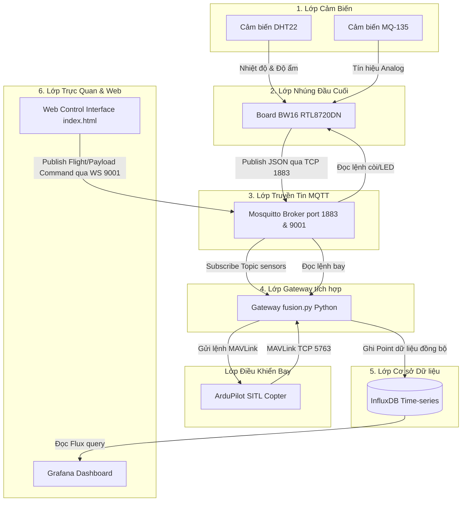
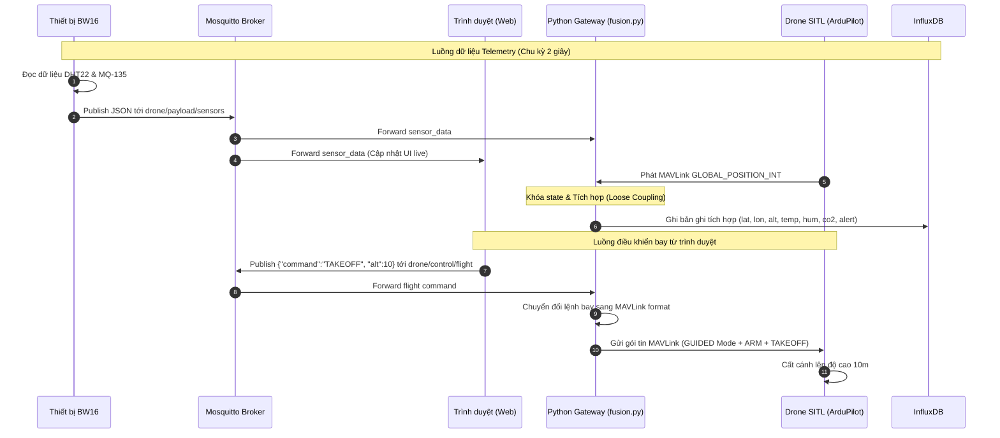

# BÁO CÁO KỸ THUẬT: HỆ THỐNG GIÁM SÁT MÔI TRƯỜNG DÙNG DRONE VÀ CÔNG NGHỆ IoT

> [!NOTE]  
> Báo cáo này trình bày thiết kế kiến trúc kỹ thuật và giải thuật tích hợp dữ liệu của hệ thống giám sát môi trường thời gian thực, kết hợp thiết bị phần cứng BW16, phần mềm mô phỏng bay ArduPilot SITL, và các công cụ lưu trữ, trực quan hóa dữ liệu công nghiệp.

---

## 1. Sơ đồ kết nối phần cứng (Pinout & Wiring Diagram)

Để thu thập dữ liệu môi trường, thiết bị phần cứng đầu cuối sử dụng vi điều khiển RTL8720DN (AmebaD board BW16) kết nối với các cảm biến DHT22 (Nhiệt độ & Độ ẩm), MQ-135 (Chất lượng không khí/CO2), và một còi báo động (Passive Buzzer).

| Thiết bị | Chân BW16 | Loại Chân | Ghi chú Kỹ thuật |
| :--- | :--- | :--- | :--- |
| **DHT22 (VCC)** | 3.3V | Cấp nguồn | Cấp nguồn 3.3V từ board BW16. |
| **DHT22 (GND)** | GND | Nối đất | Nối đất chung. |
| **DHT22 (DATA)** | `PA_26` | GPIO Input | **BẮT BUỘC** gắn thêm một điện trở Pull-up \(10\text{ k}\Omega\) nối lên nguồn 3.3V để ổn định tín hiệu 1-Wire. [1] |
| **MQ-135 (VCC)** | 5V | Cấp nguồn | **BẮT BUỘC** cấp nguồn 5V từ nguồn ngoài (hoặc cổng USB) vì cảm biến MQ-135 cần nhiệt năng cho màng nung, nguồn 3.3V của BW16 không đủ dòng. |
| **MQ-135 (GND)** | GND | Nối đất | Nối đất chung giữa nguồn ngoài và board BW16. |
| **MQ-135 (AOUT)** | `PB_1` | ADC Input | Cổng analog đọc giá trị thô từ \(0 \rightarrow 4095\) (ADC 12-bit). Cần sử dụng mạch chia điện áp (10k / 10k) để giảm điện áp ngõ ra của cảm biến từ 5V về dưới 3.3V bảo vệ chip. |
| **Buzzer (+)** | `PA_0` | GPIO Output | **LƯU Ý**: GPIO của BW16 chỉ có khả năng cấp dòng tối đa \(\sim 8\text{ mA}\). Do đó cần sử dụng một Transistor NPN 2N2222 để khuếch đại dòng điện kích còi. |
| **Buzzer (-)** | GND | Nối đất | Nối đất chung qua chân E của Transistor. |
| **Warning LED** | `PA_12` | GPIO Output | Đèn LED đỏ bật sáng cảnh báo khi nồng độ CO2 vượt ngưỡng. |

---

## 2. Kiến trúc Hệ thống (Block Diagram)

Hệ thống được thiết kế theo mô hình kiến trúc 6 lớp từ cảm biến phần cứng đến lớp hiển thị của người dùng:



---

## 3. Sơ đồ tuần tự chu kỳ dữ liệu (Sequence Diagram)

Dưới đây là sơ đồ tuần tự biểu diễn dòng dữ liệu cảm biến đi từ thiết bị đầu cuối đến cơ sở dữ liệu InfluxDB, đồng thời minh họa luồng điều khiển bay ngược từ trình duyệt về Drone:



---

## 4. Giải thích kỹ thuật: Giao thức MQTT

**MQTT (Message Queuing Telemetry Transport)** là một giao thức truyền thông điệp dạng Publish/Subscribe gọn nhẹ, chuẩn hóa bởi OASIS [2]. Khác với mô hình HTTP Request/Response truyền thống đòi hỏi thiết lập liên kết liên tục và overhead tiêu đề lớn, MQTT hoạt động thông qua một bên môi giới trung gian gọi là **Broker**.

*   **Topic Hierarchy (Cấu trúc phân cấp)**: Sử dụng các dấu gạch chéo `/` để phân tách không gian tên địa chỉ. Ví dụ trong dự án:
    *   `drone/payload/sensors`: Dành cho dữ liệu telemetry cảm biến từ BW16.
    *   `drone/control/payload`: Dành cho lệnh điều khiển còi/LED gửi tới BW16.
    *   `drone/control/flight`: Dành cho lệnh điều khiển bay gửi tới Gateway chuyển tiếp sang Drone.
*   **QoS (Quality of Service)**: Cung cấp 3 cấp độ:
    *   **QoS 0 (At most once)**: Gửi tin nhắn nhanh nhất, không đảm bảo đến đích (phù hợp gửi telemetry cảm biến chu kỳ cao).
    *   **QoS 1 (At least once)**: Đảm bảo tin nhắn đến đích ít nhất một lần (dùng cho các lệnh điều khiển bay quan trọng).
    *   **QoS 2 (Exactly once)**: Đảm bảo tin nhắn đến đích đúng một lần duy nhất (độ trễ cao nhất).
*   **Lý do lựa chọn**: MQTT có overhead tiêu đề cực nhỏ (chỉ từ \(2\text{ bytes}\)), tiêu thụ điện năng thấp, và hỗ trợ cơ chế tự reconnect rất tốt, cực kỳ tối ưu cho các thiết bị phần cứng kết nối không dây băng thông hẹp như board BW16.

---

## 5. Giải thích kỹ thuật: Giao thức MAVLink

**MAVLink (Micro Air Vehicle Link)** là một giao thức truyền thông điệp dạng Point-to-Point cực kỳ tối ưu dành cho các thiết bị bay không người lái (UAV) [3]. MAVLink mã hóa các cấu trúc dữ liệu nhị phân nhỏ gọn và truyền tải qua các giao thức mạng phổ biến như UDP/TCP hoặc kết nối Serial.

Cấu trúc một gói tin MAVLink v2.0 tiêu chuẩn:

| Trường | Độ dài | Mô tả |
| :--- | :--- | :--- |
| **STX** | 1 byte | Ký tự đánh dấu bắt đầu gói tin (MAVLink v2.0 là `0xFD`). |
| **LEN** | 1 byte | Độ dài của phần Payload dữ liệu. |
| **INC FLAGS / COMP FLAGS** | 2 bytes | Cờ tương thích và cờ ký số bảo mật. |
| **SEQ** | 1 byte | Số thứ tự gói tin để phát hiện mất mát dữ liệu. |
| **SYS ID** | 1 byte | ID của Drone gửi tin (ví dụ: 1). |
| **COMP ID** | 1 byte | ID của linh kiện gửi tin (ví dụ: autopilot = 1). |
| **MSG ID** | 3 bytes | ID định danh loại tin nhắn (0 - 16,777,215). |
| **PAYLOAD** | 0-255 bytes | Dữ liệu nhị phân thực tế của gói tin. |
| **CHECKSUM** | 2 bytes | Mã CRC kiểm tra tính toàn vẹn của gói tin. |

Các gói tin cốt lõi được sử dụng trong dự án:
1.  `GLOBAL_POSITION_INT` (MSG ID #33): Cung cấp kinh độ (lon), vĩ độ (lat), độ cao (alt), và vận tốc drone từ hệ thống định vị GPS và EKF.
2.  `COMMAND_LONG` (MSG ID #76): Dùng để truyền các lệnh thực thi từ xa như `MAV_CMD_COMPONENT_ARM_DISARM` (Kích hoạt động cơ) hay `MAV_CMD_NAV_TAKEOFF` (Cất cánh lên độ cao mong muốn).

---

## 6. Thuật toán tích hợp dữ liệu (Data Fusion Algorithm)

Hệ thống sử dụng thuật toán tích hợp dữ liệu dạng **Timestamp-based Loose Coupling (Ghép nối lỏng dựa trên dấu thời gian)** [4]. Đây là phương pháp tối ưu đối với các hệ thống prototype không đồng bộ về mặt thời gian phần cứng giữa thiết bị IoT (BW16) và autopilot của Drone (ArduPilot).

```
                 [Thread MQTT]          [Thread MAVLink]
                       │                       │
           Nhận cảm biến từ BW16        Nhận GPS từ SITL
                       │                       │
                       ▼                       ▼
            Ghi đè sensor_data          Ghi đè gps_data
                 (Shared State)          (Shared State)
                       │                       │
                       └───────────┬───────────┘
                                   │
                           [Loop Main (1s)]
                                   │
                         Đọc Snapshot dưới khóa
                                   │
                                   ▼
                         Gộp bản ghi tổng hợp
                                   │
                                   ▼
                             Ghi InfluxDB
```

### Cơ chế hoạt động:
1.  Gateway khởi chạy 2 luồng nhận song song:
    *   `mqtt_thread` liên tục cập nhật trạng thái cảm biến mới nhất nhận được từ cảm biến qua MQTT vào biến shared state `sensor_data`.
    *   `mavlink_thread` liên tục cập nhật tọa độ GPS mới nhất từ luồng dữ liệu SITL vào biến shared state `gps_data`.
2.  Để tránh xung đột tài nguyên giữa các tiến trình (Race Condition), hai biến shared state được bảo vệ nghiêm ngặt bằng cơ chế khóa loại trừ tương hỗ **Threading Lock** (\(L\)).
3.  Vòng lặp chính (Main Loop) chạy đồng bộ với chu kỳ \(T_{main} = 1.0\text{ s}\), thực hiện chụp lại snapshot dữ liệu dưới sự bảo vệ của khóa \(L\):
    \[S_k = \{ \mathbf{S}_{sensor}(t_{sensor}), \mathbf{S}_{gps}(t_{gps}) \}\]
4.  Nếu một trong hai luồng bị mất kết nối tạm thời, hệ thống sẽ thực hiện cơ chế phục hồi và điền giá trị mặc định an toàn:
    *   Nếu mất GPS: điền vĩ độ = 0.0, kinh độ = 0.0, độ cao = 0.0.
    *   Nếu mất cảm biến: điền nhiệt độ = 0.0, độ ẩm = 0.0, CO2 = 0.0, alert = 0.

### Hạn chế và Hướng cải tiến:
*   *Hạn chế*: Phương pháp ghép nối lỏng này giả định dữ liệu cảm biến và GPS có độ trễ thời gian bằng không. Trên thực tế, do chu kỳ đọc cảm biến (\(2.0\text{ s}\)) lệch pha với chu kỳ main loop (\(1.0\text{ s}\)), dữ liệu tích hợp có thể có sai lệch không gian nhỏ khi drone di chuyển ở tốc độ cao.
*   *Cải tiến*: Sử dụng hàng đợi đệm dữ liệu (Queue Buffer) và áp dụng thuật toán nội suy tuyến tính (Linear Interpolation) dựa trên timestamp thực tế để khớp tọa độ chính xác, hoặc tích hợp trực tiếp bộ lọc Kalman mở rộng (EKF) để ước lượng trạng thái động học của thiết bị.

---

## 7. Tài liệu tham khảo (IEEE Citations)

*   [1] Adafruit Industries, "DHT22 Temperature and Humidity Sensor Datasheet," Adafruit Learning System, Tech. Rep., 2017.
*   [2] OASIS Standard, "MQTT Version 3.1.1 Plus Errata 01," OASIS Consortium, Tech. Rep., Dec. 2015. [Online]. Available: http://docs.oasis-open.org/mqtt/mqtt/v3.1.1/os/mqtt-v3.1.1-os.html
*   [3] MAVLink Dev Team, "MAVLink Protocol Specification," MAVLink.io, 2020. [Online]. Available: https://mavlink.io/en/
*   [4] D. L. Hall and J. Llinas, "An introduction to multisensor data fusion," *Proceedings of the IEEE*, vol. 85, no. 1, pp. 6-23, Jan. 1997. doi: 10.1109/5.554205.
