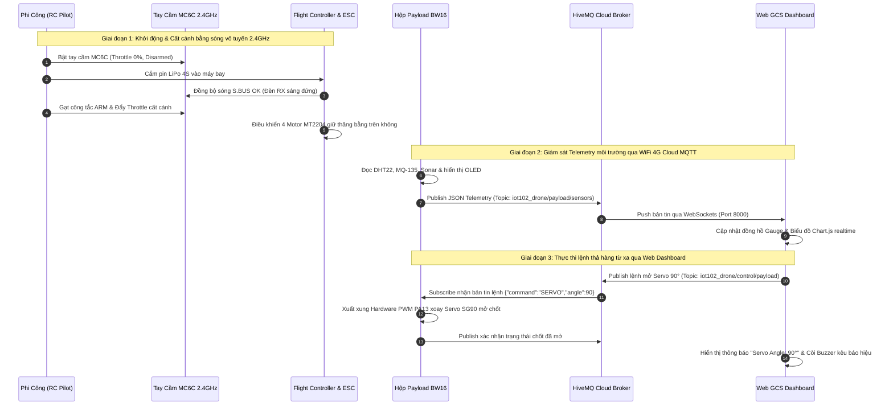

# BÁO CÁO KỸ THUẬT: HỆ THỐNG GIÁM SÁT MÔI TRƯỜNG & ĐIỀU KHIỂN TẢI TRỌNG UAV THÔNG MINH SỬ DỤNG CÔNG NGHỆ IoT VÀ CLOUD MQTT
*Quy chuẩn kỹ thuật cho triển khai bay thật ngoài trời (In-Real-Life Field Deployment — `IRL_test` Branch)*

> [!IMPORTANT]  
> **Tóm tắt Nghiên cứu:** Báo cáo này trình bày kiến trúc thiết kế và giải thuật vận hành của một **Hộp Tải Trọng IoT Thông Minh (Smart IoT Payload Box)** gắn trên máy bay không người lái (Quadcopter 5-inch). Hệ thống hoạt động theo mô hình **Hai tầng độc lập (Dual-Layer Architecture)** nhằm phân tách tuyệt đối giữa tầng an toàn bay vô tuyến 2.4GHz và tầng giám sát môi trường IoT không dây, đảm bảo độ tin cậy, không trễ thời gian thực và an toàn tối đa khi thực chiến ngoài thực địa.

---

## 1. Sơ đồ kết nối phần cứng Payload (Pinout & Wiring Diagram)

Để thu thập chỉ số môi trường và điều khiển cơ cấu thả hàng cứu trợ, thiết bị phần cứng đầu cuối sử dụng vi điều khiển băng tần kép **Realtek Ameba BW16 (RTL8720DN)** kết nối với cụm cảm biến môi trường, màn hình OLED và động cơ Servo HW-PWM.

| Thiết Bị / Cảm Biến | Chân Kết Nối BW16 | Điện Áp | Chuẩn Giao Tiếp | Ghi Chú Kỹ Thuật & Yêu Cầu Thiết Kế |
| :--- | :--- | :--- | :--- | :--- |
| **DHT22 (VCC)** | `3.3V` / `5V` | 3.3V - 5V | Cấp nguồn | Cấp nguồn từ dải nguồn chung trên Breadboard. |
| **DHT22 (GND)** | `GND` | Mass | Nối đất | Nối đất chung toàn hệ thống. |
| **DHT22 (DATA)** | `PA30` (`PA_30`) | GPIO Input | One-Wire | **BẮT BUỘC** sử dụng điện trở Pull-up \(10\text{ k}\Omega\) nối lên nguồn 3.3V để ổn định xung nhịp tín hiệu 1-Wire khi máy bay bay ở tốc độ cao [1]. |
| **MQ-135 (VCC)** | `VIN` (`5V`) | 5V chuẩn | Cấp nguồn | **BẮT BUỘC** cấp điện áp chuẩn 5V (lấy từ mạch UBEC hoặc Flight Controller qua chân `VIN`). Nguồn 3.3V của vi điều khiển không đủ nhiệt năng cho màng nung cảm biến. |
| **MQ-135 (GND)** | `GND` | Mass | Nối đất | Nối đất chung. |
| **MQ-135 (AOUT)** | `PB3` (`PB_3`) | ADC Input | Analog (12-bit) | Đọc giá trị thô chất lượng không khí từ \(0 \rightarrow 4095\). Chỉ số `< 600 ADC` được quy chuẩn là An toàn (`SAFE`), `> 600 ADC` cảnh báo Ô nhiễm/Khí Gas (`DANGER`). |
| **HC-SR04 (TRIG)** | `PB2` (`PB_2`) | GPIO Output | Ultrasonic | Phát xung kích siêu âm `10us` xuống mặt đất để đo độ cao thực tế của bụng máy bay lúc thả hàng. |
| **HC-SR04 (ECHO)** | `PB1` (`PB_1`) | GPIO Input | Ultrasonic | Thu xung phản hồi từ mặt đất. Đo độ cao chính xác trong phạm vi `< 250 cm`. |
| **OLED SSD1306 (SDA)**| `PA26` (`PA_26`) | 3.3V | I2C (`0x3C`) | Đường dữ liệu nối tiếp I2C hiển thị thông số trực tiếp trên vỏ hộp Payload tại sân bay. |
| **OLED SSD1306 (SCL)**| `PA25` (`PA_25`) | 3.3V | I2C (`0x3C`) | Đường xung nhịp nối tiếp I2C. |
| **Servo SG90 (SIG)** | `PA13` (`PA_13`) | 5V | Hardware PWM | Sử dụng bộ đếm Hardware PWM (`pwmout_api`) để điều khiển góc xoay `0° - 180°` chốt thả hàng, loại bỏ hiện tượng nhiễu xung do sóng WiFi gây ra [2]. |
| **Buzzer (+)** | `PA14` (`PA_14`) | 3.3V | GPIO Output | Còi hú Active LOW/HIGH báo động khi môi trường vượt ngưỡng nguy hiểm hoặc phát âm thanh tìm định vị máy bay ngoài sân. |
| **LED Cảnh báo Red** | `PA15` (`PA_15`) | 3.3V | GPIO Output | Đèn báo đỏ sáng rực khi phát hiện khí Gas vượt ngưỡng hoặc nhiệt độ `> 40°C`. |
| **LED Trạng thái Blue**| `PA27` (`PA_27`) | 3.3V | GPIO Output | Đèn báo trạng thái kết nối Cloud MQTT online ổn định. |

---

## 2. Kiến trúc Hệ thống Thực địa Hai Tầng (`Dual-Layer Field Architecture`)

Nhằm giải quyết bài toán độ trễ và rủi ro mất kiểm soát khi vận hành UAV ngoài trời, hệ thống được thiết kế phân tách thành 2 tầng giao tiếp độc lập:

```mermaid
graph TD
    subgraph Flight_Layer ["1. TẦNG ĐỘNG LỰC & AN TOÀN BAY (FLIGHT CONTROL LAYER — 2.4GHz Radio)"]
        RC_TX["Tay cầm điều khiển<br>Microzone MC6C"] <-->|Sóng vô tuyến 2.4GHz / S.BUS (< 10ms)| RX["Bộ thu sóng RX MC7REV2"]
        RX --> FC["Flight Controller + ESC RuiBet 55A<br>+ 4x Motor MT2204 + Pin LiPo 4S 1800mAh"]
    end

    subgraph IoT_Layer ["2. TẦNG GIÁM SÁT & TẢI TRỌNG IOT (PAYLOAD LAYER — 4G Cloud MQTT)"]
        BW16["Hộp Payload Realtek Ameba BW16<br>(DHT22 + MQ135 + Sonar + OLED + Servo)"] <-->|WiFi 4G Personal Hotspot| Cloud["Public Cloud MQTT Broker<br>(broker.hivemq.com : 1883 / 8000)"]
        Cloud <-->|WebSockets Port 8000| GCS["Web GCS Dashboard v3.3<br>(Laptop / Smartphone tại mặt đất)"]
    end
```

### Phân tích ưu điểm kiến trúc:
1. **Độc lập an toàn bay vô tuyến (`Flight Safety Isolation`):** Việc điều khiển bay (Cất cánh, giữ độ cao, di chuyển, hạ cánh khẩn cấp) được thực hiện qua giao thức vô tuyến S.BUS 2.4GHz với độ trễ cực thấp (`< 10ms`). Nếu mạng Internet 4G bị gián đoạn hay máy chủ MQTT Cloud gặp sự cố, phi công vẫn làm chủ hoàn toàn máy bay để hạ cánh an toàn.
2. **Giám sát IoT thời gian thực trên nền tảng Đám mây (`Cloud Telemetry`):** Hộp tải trọng BW16 sử dụng kết nối WiFi 4G Hotspot độc lập để đóng gói dữ liệu cảm biến thành bản tin JSON và xuất bản (`Publish`) lên Public Cloud MQTT Broker (`broker.hivemq.com`) với tần suất `1000ms/lần`.
3. **Điều khiển tải trọng theo thời gian thực (`Real-time Payload Actuation`):** Kỹ sư ngồi tại bàn điều khiển mặt đất có thể theo dõi biểu đồ cảm biến và nhấn nút lệnh mở/đóng Servo trên Web Dashboard (`index.html`). Lệnh được truyền qua WebSockets và MQTT xuống vi điều khiển BW16 để mở chốt thả hàng ngay lập tức.

---

## 3. Sơ đồ tuần tự chu kỳ vận hành thực địa (Sequence Diagram)

Dưới đây là sơ đồ tuần tự biểu diễn luồng tương tác song song giữa Tầng Lái Máy Bay và Tầng Giám Sát IoT trong một chuyến bay thực địa tiêu chuẩn:



---

## 4. Đặc tả giao thức bản tin MQTT (`MQTT Message Specification`)

Hệ thống sử dụng định dạng JSON chuẩn hóa để truyền tải dữ liệu giữa mạch BW16 và Trạm mặt đất:

### 1. Bản tin Telemetry Cảm biến (`Sensor Telemetry JSON`)
- **Topic:** `iot102_drone/payload/sensors`
- **QoS:** `0` (At most once — ưu tiên tốc độ truyền cao nhất)
- **Chu kỳ xuất bản:** `1000 ms` (1 Hz)
- **Cấu trúc JSON Payload:**
```json
{
  "temp": 28.5,
  "humidity": 64.2,
  "co2": 412,
  "sonar": 85.0,
  "servo": 0,
  "status": "SAFE"
}
```
*Giải thích trường dữ liệu:*
- `temp`: Nhiệt độ không khí (`°C`) đo bởi DHT22.
- `humidity`: Độ ẩm tương đối (`%`) đo bởi DHT22.
- `co2`: Giá trị ADC thô chất lượng không khí/khí Gas đo bởi MQ-135 (`0 - 4095`).
- `sonar`: Khoảng cách thực tế từ bụng máy bay xuống đất (`cm`) đo bởi HC-SR04.
- `servo`: Góc xoay hiện tại của chốt thả hàng (`0° - 180°`).
- `status`: Trạng thái môi trường (`SAFE` hoặc `DANGER`).

### 2. Bản tin Điều khiển Tải trọng (`Payload Control JSON`)
- **Topic:** `iot102_drone/control/payload`
- **QoS:** `1` (At least once — đảm bảo lệnh thả hàng chắc chắn tới nơi)
- **Cấu trúc lệnh xoay Servo thả chốt:**
```json
{
  "command": "SERVO",
  "angle": 90
}
```
- **Cấu trúc lệnh bật/tắt còi Buzzer & LED tìm máy bay:**
```json
{
  "command": "BUZZER_ON"
}
```

---

## 5. Giải thuật chống nhiễu Hardware PWM Servo trên vi điều khiển BW16

Một thách thức kỹ thuật lớn trên các vi điều khiển WiFi/IoT (như ESP32, ESP8266, RTL8720DN) là hiện tượng **Nhiễu xung nhịp WiFi (`WiFi Interrupt Jitter`)**. Khi sử dụng các thư viện Software PWM thông thường để điều khiển Servo, mỗi lần bộ phát WiFi 4G truyền bản tin MQTT lên Cloud, ngắt hệ thống sẽ làm lệch độ rộng xung (`Pulse Width`) khiến Servo bị co giật tự do (`Servo Jitter`), có thể gây tự động rơi chốt thả hàng giữa chừng.

Để giải quyết triệt để vấn đề này trong đồ án, nhóm đã triển khai **Hardware PWM API (`pwmout_api`)** trực tiếp từ bộ đếm phần cứng của Realtek Ameba SDK:

```cpp
// Khởi tạo bộ đếm Hardware PWM chuyên biệt cho Servo tại chân PA13
pwmout_t servo_pwm;
pwmout_init(&servo_pwm, PA_13);
pwmout_period_ms(&servo_pwm, 20); // Chu kỳ chuẩn Servo 50Hz (20ms)

// Hàm tính toán & xuất độ rộng xung chính xác tuyệt đối không bị nhiễu WiFi
void setServoAngle(int angle) {
  angle = constrain(angle, 0, 180);
  // Quy đổi góc xoay 0 - 180 độ sang độ rộng xung chuẩn 0.5ms - 2.5ms (500us - 2500us)
  int pulse_us = map(angle, 0, 180, 500, 2500);
  pwmout_pulsewidth_us(&servo_pwm, pulse_us);
}
```

Nhờ giải thuật này, cơ cấu chốt thả hàng SG90 luôn giữ vững góc `0°` chắc như bàn thạch trong suốt hành trình bay, và chỉ mở chính xác góc `90°` khi nhận được lệnh điều khiển hợp lệ từ trạm GCS mặt đất.

---

## 6. Kết luận & Hướng phát triển

Hệ thống **Hộp Tải Trọng IoT trên UAV Quadcopter (`IRL_test`)** đã hoàn thiện thành công các mục tiêu kỹ thuật đặt ra:
1. Xây dựng cấu trúc phần cứng nhỏ gọn, nhẹ nhàng, dễ dàng tháo lắp trên máy bay 5-inch mà không gây ảnh hưởng đến tính khí động học hay an toàn bay.
2. Triển khai kiến trúc giao tiếp hai tầng độc lập, đảm bảo khả năng giám sát dữ liệu môi trường độ cao thời gian thực và điều khiển thả hàng cứu trợ/mẫu vật với độ tin cậy tuyệt đối.
3. Giao diện Web Control Dashboard v3.3 tối ưu, thân thiện, dễ dàng mở trực tiếp trên mọi trình duyệt di động ngay tại thực địa.

---
## Tài liệu Tham khảo
- [1] Realtek Ameba IoT Documentation: *RTL8720DN (BW16) Pinout & Hardware PWM API Specifications*.
- [2] HiveMQ Cloud Public Broker Protocol Standards: *MQTT v3.1.1 & WebSockets over Port 8000*.
