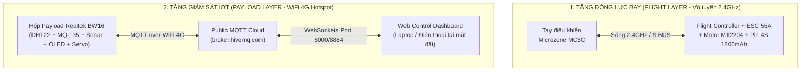

# 🚀 CẨM NANG HƯỚNG DẪN BAY THẬT THỰC ĐỊA (IRL FLIGHT & FIELD OPERATIONS)
*Tài liệu hướng dẫn chuẩn cho nhánh `IRL_test` — Đồ án IOT102 Drone Environmental Payload*

---

## 📋 1. KIẾN TRÚC HOẠT ĐỘNG THỰC ĐỊA (FIELD ARCHITECTURE)

Khi mang máy bay ra sân bay ngoài trời, hệ thống hoạt động theo kiến trúc **Hai tầng độc lập (Dual-Layer Architecture)** nhằm tối ưu độ tin cậy và an toàn:



### 💡 Ưu điểm của mô hình:
- **Tách biệt an toàn tuyệt đối:** Việc điều khiển bay (Cất cánh, nhào lộn, hạ cánh) hoàn toàn do tay cầm **MC6C 2.4GHz** đảm nhiệm, không bị độ trễ hay ảnh hưởng bởi tốc độ mạng Internet.
- **Giám sát IoT thời gian thực:** Hộp cảm biến **BW16** gắn dưới bụng máy bay tự động kết nối WiFi 4G từ điện thoại phát ra, liên tục đẩy dữ liệu chất lượng không khí, nhiệt độ, độ ẩm và khoảng cách thả hàng về Web Dashboard. Bạn có thể nhấn nút thả chốt Servo từ bất cứ đâu!

---

## 🛠️ 2. CHUẨN BỊ TRƯỚC CHUYẾN BAY (PRE-FLIGHT SETUP)

### Bước 1: Cấu hình WiFi 4G cho mạch BW16
Trước khi ra sân, bạn bật tính năng **Phát WiFi di động (Personal Hotspot)** trên điện thoại 4G.
1. Mở tệp `Phase3_BW16/bw16_sensor/secrets.h` trong Arduino IDE.
2. Nhập chính xác Tên WiFi (`SECRET_SSID`) và Mật khẩu (`SECRET_PASS`) của điện thoại:
   ```cpp
   #define SECRET_SSID "Ten_WiFi_4G_Cua_Ban"
   #define SECRET_PASS "Mat_Khau_WiFi_4G"
   ```
3. Nạp lại firmware (`Upload`) vào mạch BW16 và kiểm tra trên Serial Monitor (115200 baud) thấy báo `[WIFI] Connected OK!`.

### Bước 2: Kiểm tra pin & lắp đặt phần cứng
- **Pin bay 4S 1800mAh:** Kiểm tra sạc đầy đạt **`16.8V`** (mỗi cell ~4.20V) bằng bộ sạc LiPo Balance.
- **Lắp hộp Payload:** Gắn chắc chắn hộp BW16 + cảm biến + cơ cấu chốt Servo SG90 vào bụng hoặc khung carbon máy bay bằng dây thút (Zip-ties) hoặc băng dính gai (Velcro). Đảm bảo cảm biến siêu âm (HC-SR04) hướng thẳng xuống đất và không bị che khuất bởi cánh quạt.
- **Lắp cánh quạt:** Kiểm tra chặt ốc và lắp đúng chiều Thuận/Nghịch (CW/CCW).

---

## 🖥️ 3. HƯỚNG DẪN SỬ DỤNG WEB DASHBOARD TẠI SÂN BAY

Tại sân bay ngoài trời, bạn mở máy tính xách tay (Laptop) hoặc điện thoại thông minh, kết nối vào cùng mạng WiFi 4G Hotspot (hoặc 4G độc lập) và làm theo các bước:

1. **Mở giao diện Web Dashboard:**
   - Mở tệp `Phase5_Operations/web_control/index.html` (hoặc `3_Web_GCS_Dashboard/index.html`) bằng trình duyệt Chrome/Firefox (`Ctrl + O` / `Cmd + O`).
2. **Kết nối Cloud MQTT:**
   - Tại góc trên bên phải màn hình, kiểm tra `MQTT Broker` đang để mặc định là `broker.hivemq.com` (Port `8000` cho WebSockets).
   - Nhấn nút **`Connect`**. Khi đèn trạng thái chuyển sang màu xanh lá **`Online`**, hệ thống đã kết nối thành công.
3. **Giám sát thông số cảm biến (Sensors Panel):**
   - **Temperature / Humidity:** Đọc liên tục từ DHT22 gắn trên máy bay.
   - **CO2 / Gas ADC & Air Quality:** Đọc từ MQ-135. Nếu Gas `> 600 ADC` hoặc Nhiệt độ `>= 40°C`, màn hình OLED trên máy bay sẽ chớp nháy và Web báo trạng thái Đỏ **`CẢNH BÁO O NHIEM` / `CẢNH BÁO NHIỆT`**.
   - **Sonar Dist:** Khoảng cách thực tế từ bụng máy bay xuống mặt đất (độ cao thả hàng chính xác dưới 1 mét).

4. **Điều khiển Payload đồ án (Thả chốt & Tìm máy bay):**
   - **Thả chốt Servo (Drop Mechanism):** Kéo thanh trượt góc `Servo Angle` (từ `0°` sang `90°` hoặc `180°`) hoặc nhấn nút thả chốt. chốt Servo trên máy bay sẽ xoay ngay lập tức (< 150ms) để thả gói hàng cứu trợ/mô hình xuống đất.
   - **Còi báo động tìm kiếm (Buzzer Alarm):** Nhấn nút **`Buzzer ON`** trên Dashboard nếu cần phát còi hú tìm máy bay rơi trong bụi rậm ngoài sân bay.

---

## ✈️ 4. QUY TRÌNH BAY THẬT NGOÀI TRỜI (EXECUTIVE CHECKLIST)

| Bước | Hành động | Người thực hiện | Tiêu chí đạt |
| :---: | :--- | :--- | :--- |
| **1** | Bật nguồn tay cầm MC6C & gạt nút ARM về vị trí khóa (`DISARM`). | Pilot (Lái bay) | Màn hình/đèn tay cầm sáng ổn định. |
| **2** | Cắm pin 4S 1800mAh vào máy bay (cấp nguồn cho FC và hộp BW16). | Pilot + IoT Dev | Nghe tiếng "Tít tít tít - Tít tít!" từ ESC; mạch BW16 sáng đèn. |
| **3** | Kiểm tra Web Dashboard trên Laptop. | GCS Operator | Các thông số Temp, Hum, Gas, Sonar hiển thị số liệu thực tế, không bị `--`. |
| **4** | Lùi xa máy bay ít nhất 5 mét. Nhấn nút ARM trên tay cầm MC6C. | Pilot | 4 động cơ quay đều ở mức ga chờ (Idle speed). |
| **5** | Đẩy từ từ cần ga lên `35% - 45%` để nhấc máy bay lên độ cao 2 - 3 mét. | Pilot | Máy bay lơ lửng thăng bằng, tiếng máy nổ êm. |
| **6** | Quan sát thông số & Nhấn nút thả chốt Servo trên Web Dashboard. | GCS Operator | Chốt mở thả gói hàng rơi chính xác vào mục tiêu. |
| **7** | Hạ cánh an toàn xuống đất (`LAND`) & Gạt khóa động cơ (`DISARM`). Rút giắc pin. | Pilot | Kết thúc chuyến bay an toàn hoàn hảo! |

---

## 🚨 5. CÁC NGUYÊN TẮC AN TOÀN SỐNG CÒN (SAFETY RULEBOOK)
1. **Mốc điện áp hạ cánh khẩn cấp:** Khi bay ngoài sân, nếu đo điện áp pin 4S tụt xuống mức **`14.0V`** (tương đương `3.50V / cell`), bắt buộc phải hạ cánh ngay lập tức. Tuyệt đối không ráng bay kiệt dưới `13.2V` sẽ làm hỏng pin và rớt máy bay.
2. **Không bay gần khu dân cư / dây điện:** Chọn sân cỏ rộng, sân bóng hoặc khu đất trống xa đường giao thông.
3. **Luôn có người quan sát phụ (Spotter):** Một người chuyên tập trung lái máy bay (Pilot), một người chuyên giám sát Web Dashboard (GCS Operator).
