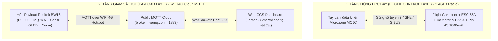

# Drone IoT — Hệ Thống Giám Sát Môi Trường & Điều Khiển Tải Trọng UAV Thông Minh
*Dự án đồ án môn học IOT102 — Triển khai Bay Thật Thực Địa (`IRL_test` Branch)*

---

## 🌟 TỔNG QUAN DỰ ÁN (PROJECT OVERVIEW)

> [!IMPORTANT]
> 🌐 **NHÁNH BAY THẬT THỰC ĐỊA (`IRL_test` BRANCH):**
> Nhánh này được tối ưu và cấu hình chuyên biệt cho việc **Kiểm thử & Triển khai Bay Thật ngoài trời (In-Real-Life Field Testing)** với Quadcopter 5 inch (`Motor MT2204 + ESC 55A + Flight Controller + Tay cầm MC6C + Pin 4S 1800mAh`) kết hợp Hộp tải trọng IoT không dây độc lập (`Realtek BW16 + WiFi 4G Hotspot + Cloud MQTT`).
> 
> 👉 **Xem ngay cẩm nang hướng dẫn chi tiết từng bước ra sân bay tại:** **[`IRL_FLIGHT_GUIDE.md`](file:///Users/trankhanhtuong/Desktop/IOT102_DRONE-PROJECT/IRL_FLIGHT_GUIDE.md)**

Dự án nghiên cứu thiết kế và triển khai một **Hộp Tải Trọng IoT Thông Minh (Smart IoT Payload Box)** gắn dưới bụng máy bay không người lái (UAV Quadcopter). Hệ thống sử dụng vi điều khiển **Realtek Ameba BW16 (RTL8720DN)** chuẩn WiFi băng tần kép để thu thập các chỉ số môi trường theo thời gian thực (Nhiệt độ, Độ ẩm, Khí Gas/CO2, Khoảng cách Sonar) và cho phép điều khiển cơ cấu chốt Servo thả hàng cứu trợ/mô hình từ xa thông qua giao thức **MQTT Cloud** và **Web Control Dashboard**.

---

## 🏗️ KIẾN TRÚC HOẠT ĐỘNG THỰC ĐỊA (DUAL-LAYER FIELD ARCHITECTURE)

Nhằm tối ưu độ tin cậy và đảm bảo an toàn tuyệt đối khi bay ngoài trời, hệ thống được thiết kế tách biệt theo **Hai tầng vận hành độc lập (Dual-Layer Architecture)**:



### 💡 Điểm sáng kỹ thuật:
1. **Độc lập an toàn bay:** Tầng lái máy bay (Cất cánh, di chuyển, hạ cánh) được điều khiển hoàn toàn bằng sóng vô tuyến 2.4GHz có độ trễ cực thấp (< 10ms), không phụ thuộc vào mạng Internet hay máy chủ đám mây.
2. **Giám sát IoT không dây thời gian thực:** Hộp BW16 tự động bắt WiFi 4G từ điện thoại phát ra, đẩy dữ liệu telemetry môi trường về Public Cloud MQTT với tần suất 1s/lần.
3. **Hardware PWM Servo Control:** Cơ cấu chốt Servo SG90 thả hàng sử dụng bộ đếm Hardware PWM (`pwmout_api`), đảm bảo chốt mở chính xác tuyệt đối mà không bị xung nhịp WiFi phá sóng như các thư viện Software PWM thông thường.

---

## 📦 CẤU TRÚC THƯ MỤC CHUẨN (PROJECT DIRECTORY STRUCTURE)

Toàn bộ dự án được quy hoạch khoa học thành 3 thư mục cốt lõi:

```text
IOT102_DRONE-PROJECT/
├── README.md                 # Tài liệu tổng quan đồ án (File bạn đang đọc)
├── IRL_FLIGHT_GUIDE.md       # Cẩm nang hướng dẫn bay thật thực địa A-Z
├── .gitignore                # Cấu hình bỏ qua tệp tạm & mật khẩu WiFi
│
├── 1_BW16_IoT_Payload/       # [PHẦN CỨNG & FIRMWARE IOT PAYLOAD GẮN TRÊN UAV]
│   ├── wiring_diagram.md     # Sơ đồ đấu nối chân mạch BW16 với cảm biến & Servo
│   └── bw16_sensor/
│       ├── bw16_sensor.ino   # Mã nguồn C++ chính (DHT22, MQ-135, Sonar, OLED, HW-PWM Servo)
│       └── secrets.h         # Template cấu hình Tên WiFi & Mật khẩu 4G Hotspot
│
├── 2_Web_GCS_Dashboard/      # [GIAO DIỆN TRẠM MẶT ĐẤT - GROUND CONTROL STATION]
│   ├── index.html            # Giao diện điều khiển Web Dashboard (Cloud MQTT WebSockets)
│   ├── assets/css/styles.css # Bảng tạo kiểu tối màu chuyên nghiệp (Dark HUD Design)
│   └── assets/js/app.js      # Logic xử lý MQTT, biểu đồ Chart.js & điều khiển chốt
│
└── 3_Academic_Reports/       # [BÁO CÁO HỌC THUẬT & TÀI LIỆU BẢO VỆ]
    ├── academic_report.md    # Báo cáo đồ án toàn văn theo chuẩn học thuật
    ├── checklist.md          # Bảng tự đánh giá tiêu chuẩn kỹ thuật đồ án
    └── DEFENSE_FAQ.md        # Bộ câu hỏi phản biện từ Hội đồng & lời giải chi tiết
```

---

## ⚙️ THÀNH PHẦN PHẦN CỨNG IOT (PAYLOAD HARDWARE)

| Linh kiện | Chân kết nối trên BW16 | Điện áp | Giao thức | Chức năng trong đồ án |
| :--- | :--- | :--- | :--- | :--- |
| **DHT22** | DATA → `PA30` | 3.3V | One-Wire | Đo Nhiệt độ (`°C`) & Độ ẩm (`%`) không khí tại độ cao bay |
| **MQ-135** | AOUT → `PB3` | 5V | Analog ADC | Đo mức độ ô nhiễm CO2/Khí Gas (`ADC < 600 là SAFE`) |
| **HC-SR04** | TRIG → `PB2`, ECHO → `PB1` | 5V | Ultrasonic | Đo khoảng cách bụng máy bay xuống đất (hỗ trợ canh thả hàng) |
| **OLED SSD1306** | SDA → `PA26`, SCL → `PA25` | 3.3V | I2C (`0x3C`) | Hiển thị thông số trực tiếp trên vỏ hộp Payload |
| **Servo SG90** | SIG → `PA13` (`PA_13`) | 5V | Hardware PWM | Cơ cấu chốt xoay `0° - 180°` thả gói hàng xuống đất |
| **Buzzer** | I/O → `PA14` | 3.3V | GPIO (Active LOW) | Còi báo động môi trường & phát âm thanh tìm máy bay |
| **LED Cảnh báo** | Đỏ → `PA15`, Xanh → `PA27` | 3.3V | GPIO (Active HIGH) | Đèn báo trạng thái An toàn (`SAFE`) hoặc Cảnh báo (`DANGER`) |

---

## 🚀 HƯỚNG DẪN KHỞI ĐỘNG NHANH THỰC ĐỊA (QUICK START)

### Bước 1: Nạp Firmware vào mạch BW16
1. Mở `1_BW16_IoT_Payload/bw16_sensor/secrets.h` bằng **Arduino IDE 2.x**.
2. Điền thông tin WiFi 4G Hotspot từ điện thoại của bạn:
   ```cpp
   #define SECRET_SSID "Ten_WiFi_4G_Cua_Ban"
   #define SECRET_PASS "Mat_Khau_WiFi_4G"
   ```
3. Chọn Board: **`AI-Thinker BW16`** (cần cài đặt package *Ameba RTL8720DN*).
4. Nhấn **Upload** để nạp code vào mạch. Gắn mạch lên máy bay cùng cụm pin.

### Bước 2: Mở Giao Diện Trạm Mặt ĐẤT (Web GCS)
1. Tại sân bay, kết nối Laptop hoặc Smartphone vào cùng mạng WiFi 4G Hotspot.
2. Mở trực tiếp tệp **[`index.html`](file:///Users/trankhanhtuong/Desktop/IOT102_DRONE-PROJECT/2_Web_GCS_Dashboard/index.html)** bằng trình duyệt Chrome/Firefox (`Ctrl + O` / `Cmd + O`).
3. Kiểm tra MQTT Broker để mặc định `broker.hivemq.com` (Port `8000`). Nhấn **Connect**.
4. Khi đèn chuyển sang **`Online`**, bạn có thể quan sát đồ thị cảm biến thực tế và kéo thanh Servo để mở chốt thả hàng ngay lập tức!

---

## 🎓 TÀI LIỆU THAM KHẢO & BẢO VỆ
- 📖 **Chi tiết quy trình cất cánh ngoài trời:** Xem tại `IRL_FLIGHT_GUIDE.md`.
- ❓ **Bộ câu hỏi bảo vệ trước Hội đồng:** Xem tại `3_Academic_Reports/DEFENSE_FAQ.md`.
- 📝 **Báo cáo tổng kết môn học:** Xem tại `3_Academic_Reports/academic_report.md`.

---
> **Tác giả:** Nhóm Phát Triển Đồ Án IOT102 Drone Environmental Payload
> **Bản quyền:** Khoa Công Nghệ Thông Tin & IoT — 2026
