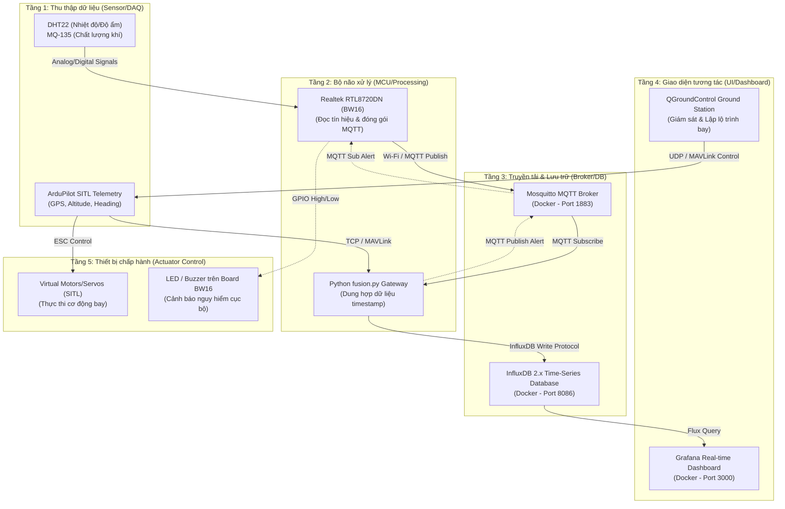

# IOT102_DRONE-PROJECT

> **Hệ thống giám sát Drone IoT tích hợp dữ liệu cảm biến thực tế và mô phỏng bay ảo.**
> 
> *A Drone IoT monitoring system integrating real-world sensor telemetry and simulated virtual flight data.*

---

## 📌 Tổng Quan Dự Án / Project Overview

Dự án này cung cấp tài liệu hướng dẫn và mã nguồn hoàn chỉnh nhằm thiết lập một hệ thống **Drone IoT** khép kín, đã được kiểm chứng hoạt động ổn định trên cả hai hệ điều hành **macOS (M-series)** và **Windows**.

Hệ thống hoạt động theo cơ chế dung hợp dữ liệu (Data Fusion):
1. **Dữ liệu thật**: Nhiệt độ (DHT22) và chất lượng không khí (MQ-135) từ board vật lý **BW16 (Realtek)** truyền qua giao thức **MQTT**.
2. **Dữ liệu ảo**: Tọa độ GPS, độ cao, vận tốc từ drone mô phỏng **ArduPilot SITL**.
3. **Gateway Fusion**: Script Python đồng bộ hóa hai luồng dữ liệu theo thời gian thực và đẩy lên cơ sở dữ liệu **InfluxDB**.
4. **Dashboard**: Trực quan hóa dữ liệu sinh động trên **Grafana**.

---

## 📂 Cấu Trúc Repository / Repository Structure

Kho lưu trữ được chia làm 2 thư mục độc lập tối ưu cho từng hệ điều hành:

```
IOT102_DRONE-PROJECT/
├── .gitignore
├── README.md                 <-- [Bạn đang ở đây / You are here]
│
├── DroneIoT_macOS/           <-- Dành cho macOS (Apple Silicon M1/M2/M3/M4)
│   ├── README.md             <-- Hướng dẫn chi tiết cho macOS
│   ├── Phase1_Docker/        <-- docker-compose.yml + mosquitto.conf + setup.sh
│   ├── Phase2_SITL/          <-- Scripts cài đặt & chạy ArduPilot SITL
│   ├── Phase3_BW16/          <-- Sketch Arduino (.ino) & Sơ đồ đấu nối phần cứng
│   ├── Phase4_Fusion/        <-- Python fusion.py + venv setup script
│   └── Phase5_Operations/    <-- Scripts khởi chạy/dừng toàn hệ thống & checklist
│
└── DroneIoT_Windows/         <-- Dành cho Windows 10/11 (Sử dụng WSL2)
    ├── README.md             <-- Hướng dẫn chi tiết cho Windows
    ├── Phase1_Docker/        <-- docker-compose.yml + setup.bat
    ├── Phase2_SITL/          <-- WSL2 setup guide & PowerShell run scripts
    ├── Phase3_BW16/          <-- Sketch Arduino & Sơ đồ đấu nối phần cứng
    ├── Phase4_Fusion/        <-- Python fusion.py + Batch venv setup script
    └── Phase5_Operations/    <-- Batch scripts khởi chạy/dừng toàn hệ thống & checklist
```

---

## 🚀 Kiến Trúc Hệ Thống 5 Tầng / 5-Layer System Architecture

Hệ thống được thiết kế và triển khai tuân thủ mô hình kiến trúc IoT tiêu chuẩn:



### Chi tiết các tầng:

1. **Tầng 1: Sensor / Actuator => Data Acquisition (Thu thập dữ liệu)**
   - **Môi trường thực**: Cảm biến DHT22 (Nhiệt độ, Độ ẩm) và MQ-135 (Chất lượng không khí) đo lường môi trường vật lý.
   - **Môi trường ảo**: Drone ảo ArduPilot SITL cung cấp dữ liệu GPS (Vĩ độ, Kinh độ), Độ cao (Altitude), Vận tốc (Heading/Velocity).
2. **Tầng 2: MCU/SBC => Processing (Xử lý)**
   - **Board Edge**: Vi điều khiển **Realtek RTL8720DN (BW16)** xử lý các tín hiệu thô analog/digital từ cảm biến và phát chu kỳ gửi dữ liệu.
   - **Bộ xử lý dung hợp (Gateway)**: Script Python `fusion.py` tiếp nhận đồng thời dữ liệu MAVLink và MQTT để thực hiện phép toán dung hợp tọa độ GPS với các chỉ số môi trường tương ứng tại thời điểm đo.
3. **Tầng 3: Cloud / MQTT Broker / Database (Truyền tải & Lưu trữ)**
   - **MQTT Broker**: Eclipse Mosquitto (Docker) chịu trách nhiệm chuyển tiếp tin nhắn gọn nhẹ từ board BW16.
   - **Database**: InfluxDB 2.x (Docker) lưu trữ dữ liệu dung hợp dưới dạng Time-Series để tối ưu hóa việc truy vấn và vẽ biểu đồ.
4. **Tầng 4: Dashboard / Web Control / Ground Station (Giao diện người dùng)**
   - **Ground Station**: QGroundControl kết nối với Drone SITL qua cổng UDP 14550 để lập lộ trình bay.
   - **Dashboard**: Grafana kết nối với InfluxDB 2.x để hiển thị trực quan dữ liệu.
   - **Web Control Interface**: Giao diện điều khiển trình duyệt tối giản kết nối trực tiếp Mosquitto qua cổng WebSocket 9001, cho phép phát lệnh còi/LED tới BW16 và lệnh bay tới SITL.
5. **Tầng 5: Actuator Control (Điều khiển chấp hành)**
   - **Drone ảo**: SITL nhận lệnh bay từ Web Control hoặc QGroundControl và điều khiển động cơ ảo cất cánh, hạ cánh.
   - **Phần cứng thực**: Board BW16 nhận lệnh từ Web Control hoặc tự động kích hoạt còi/LED cảnh báo khi nồng độ CO2 vượt ngưỡng 600.
   - **Bộ kiểm thử (Tests)**: Tích hợp sẵn 4 kịch bản kiểm thử tự động (Tính liên tục dữ liệu, Độ trễ, Khả năng chịu lỗi, Web Control) trong thư mục vận hành.

---

## 🔄 Tóm Tắt Luồng Dữ Liệu / Data Flow Summary

Hệ thống hoạt động theo vòng lặp khép kín:

| Thành Phần | Nguồn Dữ Liệu | Giao Thức Truyền | Nơi Tiếp Nhận |
| :--- | :--- | :--- | :--- |
| **Không gian ảo** | ArduPilot SITL | TCP / MAVLink | Python (Data Fusion) |
| **Môi trường thực** | BW16 + DHT22/MQ-135 | Wi-Fi / MQTT | MQTT Broker (Mosquitto) $\rightarrow$ Python |
| **Hợp nhất (Fusion)** | Script Python | InfluxDB API Protocol | Time-Series Database (InfluxDB) |
| **Hiển thị trực quan** | InfluxDB | Flux Query | Grafana Dashboard |
| **Phản hồi chấp hành** | QGroundControl / Gateway | UDP MAVLink / MQTT Pub | SITL Motor (ảo) / BW16 GPIO LED (thật) |

---

## 🔌 Hướng Dẫn Đấu Nối & Khởi Động Phần Cứng Chi Tiết / Detailed Hardware Guide

Để khởi động phần cứng và đưa dữ liệu thực tế vào hệ thống, thực hiện theo các bước chi tiết sau:

### 1. Chuẩn bị và Đấu nối phần cứng
Đấu nối các chân cảm biến với board BW16 dựa trên sơ đồ dưới đây. 

> [!WARNING]
> Cảm biến MQ-135 sử dụng nguồn 5V nhưng chân ADC của BW16 chỉ chịu được tối đa 3.3V. **Bắt buộc** phải sử dụng cầu phân áp (Voltage Divider) gồm 2 điện trở 10kΩ để hạ điện áp tín hiệu trước khi đưa vào chân `PB_1`.

* **Sơ đồ đấu nối chi tiết**:
  * **DHT22**: VCC $\rightarrow$ 3.3V, GND $\rightarrow$ GND, DATA $\rightarrow$ `PA_26` (Cần thêm điện trở pull-up 10kΩ giữa VCC và DATA).
  * **MQ-135**: VCC $\rightarrow$ 5V, GND $\rightarrow$ GND, AOUT $\rightarrow$ Cầu phân áp (Điểm giữa 2 điện trở 10kΩ nối vào `PB_1`).

### 2. Cài đặt môi trường & Cấu hình Code trên Arduino IDE
1. Mở Arduino IDE, cài đặt Board Package **AmebaD** (Tìm kiếm `AmebaD` trong Boards Manager) và cài đặt thư viện `DHT sensor library` + `PubSubClient`.
2. Mở tệp firmware `bw16_sensor.ino` nằm trong thư mục `Phase3_BW16`.
3. Cấu hình các thông số mạng của bạn trong code:
   ```cpp
   const char* ssid = "TEN_WIFI_CUA_BAN";
   const char* password = "MAT_KHAU_WIFI";
   const char* mqtt_server = "IP_MAY_TINH_CHAY_DOCKER"; // Ví dụ: "192.168.1.15"
   ```
4. Chọn đúng Board: `AmebaD (RTL8720DN)` $\rightarrow$ `BW16` và chọn đúng Cổng COM (Port) tương ứng với mạch.

### 3. Quy trình Nạp Code (Upload Mode) cho BW16
Nhấn nút trên board để đưa BW16 vào chế độ nạp khi Arduino IDE bắt đầu đếm ngược upload:
1. Nhấn nút **Upload** trên Arduino IDE.
2. Khi IDE bắt đầu hiện dòng log kết nối nạp, **nhấn và giữ** nút **BURN** trên board.
3. Trong khi vẫn giữ nút BURN, **nhấn và thả** nút **RESET** một lần.
4. **Thả** nút **BURN** ra. Màn hình IDE sẽ hiển thị tiến trình nạp phần trăm chạy đến `Upload Image done`.

### 4. Khởi động và Giám sát Phần cứng (Normal Execution Mode)
Sau khi nạp code thành công, board vẫn đang ở chế độ chờ nạp (Upload mode), bạn cần khởi động chạy thực tế:
1. **Nhấn nút RESET một lần** trên board (hoặc rút dây USB và cắm lại nguồn) để mạch tự khởi động lại ở chế độ chạy bình thường (Normal Mode).
2. Mở công cụ **Serial Monitor** trên Arduino IDE và chọn tốc độ Baudrate là **115200**.
3. **Quan sát nhật ký hoạt động:**
   * Mạch sẽ in ra quá trình kết nối Wi-Fi: `Connecting to SSID... Wi-Fi connected! IP address: 192.168...`
   * Mạch kết nối tới MQTT Broker: `Attempting MQTT connection... connected`
   * Mạch bắt đầu đọc cảm biến và gửi dữ liệu lên Broker:
     ```text
     Publishing: dht/temperature -> 28.50
     Publishing: dht/humidity -> 65.20
     Publishing: mq135/air_quality -> 125.00
     ```
4. **Đóng vòng lặp**: Led xanh lá cây trên board sẽ chớp tắt định kỳ báo hiệu trạng thái hoạt động tốt.

---

## 🛠️ Hướng Dẫn Khởi Chạy Nhanh / Quick Start

### 1. Chọn phiên bản phù hợp với hệ điều hành của bạn:
* Nếu sử dụng **macOS**, chuyển vào thư mục: [`DroneIoT_macOS/README.md`](file:///Users/trankhanhtuong/.gemini/antigravity/scratch/IOT102_DRONE-PROJECT/DroneIoT_macOS/README.md)
* Nếu sử dụng **Windows**, chuyển vào thư mục: [`DroneIoT_Windows/README.md`](file:///Users/trankhanhtuong/.gemini/antigravity/scratch/IOT102_DRONE-PROJECT/DroneIoT_Windows/README.md)

### 2. Các bước chuẩn bị quan trọng:
* **Docker Desktop**: Phải được cài đặt và đang chạy.
* **Arduino IDE**: Cài đặt AmebaD package & thư viện như hướng dẫn phần cứng ở trên.
* **Python 3.10+**: Cài đặt trên máy tính làm Gateway Fusion.

---

## 📝 Bản Quyền / License

Dự án này được xây dựng cho môn học **IOT102** - Trường Đại học FPT.
*Phát triển bởi Khánh Tường.*

