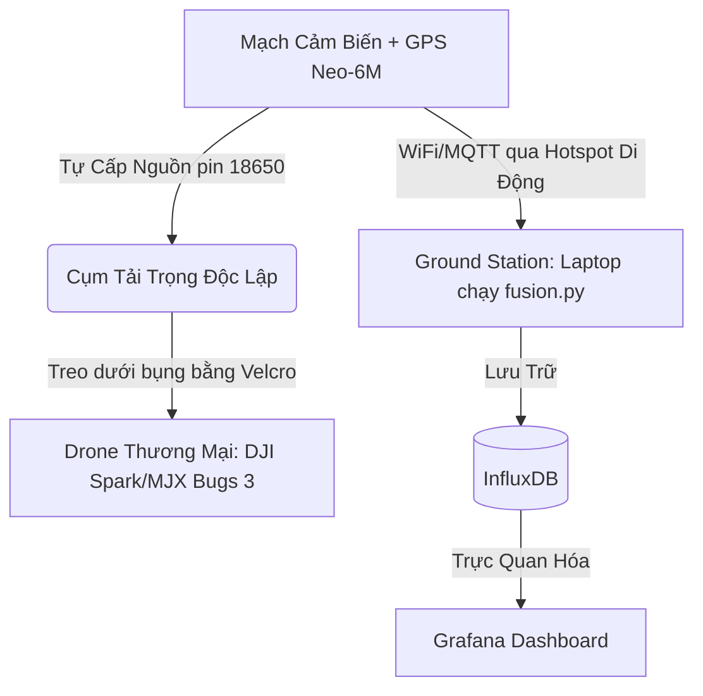
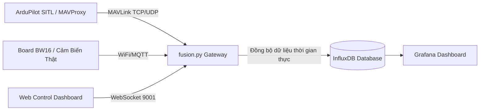

# IOT102 Drone IoT Project

Hệ thống giám sát môi trường trên drone, kết hợp dữ liệu cảm biến thực tế từ board BW16 và dữ liệu bay từ mô phỏng ArduPilot SITL.

---

## Mục lục

1. [Tổng quan](#tổng-quan)
2. [Cấu trúc thư mục](#cấu-trúc-thư-mục)
3. [Kiến trúc hệ thống](#kiến-trúc-hệ-thống)
4. [Phần cứng — Đấu nối BW16](#phần-cứng--đấu-nối-bw16)
5. [Cài đặt lần đầu](#cài-đặt-lần-đầu)
6. [Khởi động hàng ngày](#khởi-động-hàng-ngày)
7. [Dừng hệ thống](#dừng-hệ-thống)
8. [Kiểm thử tự động](#kiểm-thử-tự-động)
9. [Xử lý sự cố](#xử-lý-sự-cố)
10. [Các phương án ứng dụng](#các-phương-án-ứng-dụng-application-modes)

---

## Tổng quan

Hệ thống gồm 3 luồng dữ liệu chính:

- **Cảm biến thực (BW16)**: DHT22 đo nhiệt độ/độ ẩm, MQ-135 đo chất lượng không khí. Dữ liệu gửi qua WiFi theo giao thức MQTT.
- **Drone ảo (SITL)**: ArduPilot SITL mô phỏng GPS, độ cao, vận tốc. Kết nối qua giao thức MAVLink/TCP.
- **Gateway tổng hợp (fusion.py)**: Script Python nhận cả hai luồng, đồng bộ theo thời gian thực và ghi vào InfluxDB.

Giao diện gồm Grafana (biểu đồ) và Web Control (điều khiển còi/LED và lệnh bay).

---

## Các phương án ứng dụng (Application Modes)

Hệ thống hỗ trợ song song hai hướng triển khai tùy thuộc vào giai đoạn và trang thiết bị thực địa:

### 1. Phương Án Bay Thật (Real Flight - Độc lập & Tối giản)

Phương án này biến cụm mạch cảm biến của bạn thành một bộ **tải trọng độc lập (Payload)** treo dưới bụng bất kỳ chiếc Drone thương mại nào. Bạn không cần chế tạo drone phức tạp từ đầu hay lập trình Companion Computer nhằm tối ưu chi phí và tăng độ an toàn.



* **Triết lý thiết kế (Design Philosophy):**
  * **Zero Flight Controller Integration:** Hoàn toàn tách biệt nguồn điện và tín hiệu điều khiển khỏi mạch bay gốc của Drone. Điều này loại bỏ hoàn toàn rủi ro gây chập nguồn hoặc can thiệp vào thuật toán ổn định bay của drone gốc.
  * **Plug-and-Play Payload:** Lắp đặt dễ dàng bằng các khớp hoặc băng dán Velcro dưới bụng của bất kỳ drone nào có tải nâng lớn hơn tổng khối lượng cụm mạch (\( \approx 70\text{g} \)).

* **Danh sách chuẩn bị & mua sắm:**
  * **Drone thương mại cõng tải:** 
    * *Phương án thuê:* Thuê DJI Spark hoặc DJI Mavic Mini (giá thuê khoảng ~150k - 200k/ngày) tại các cửa hàng thiết bị ảnh. DJI Spark có tải trọng nâng thêm khoảng 100g - 150g, giữ vị trí đứng yên cực tốt nhờ GPS và cảm biến quang học dòng chảy dưới bụng [1].
    * *Phương án mua cũ:* Mua các dòng drone đồ chơi cỡ trung dùng động cơ không chổi than (brushless) khỏe như **MJX Bugs 3** (giá cũ ~800k - 1.2tr) có sẵn ngàm gá camera hành trình [2], hoặc dòng dùng động cơ chổi than giảm tốc như **Syma X8C** (giá cũ ~500k - 800k) với khả năng nâng vật nặng tối đa lên tới 100g - 200g [3].
  * **Module GPS Neo-6M:** Giá khoảng 80.000 VNĐ. Giúp lấy tọa độ địa lý thực tế (Kinh độ/Vĩ độ) ngoài trời để gửi kèm dữ liệu cảm biến về trạm mặt đất [5].
  * **Nguồn nuôi di động nhẹ:**
    * 01 viên pin sạc 18650 dung lượng thực (như cell pin Panasonic/LG 2500mAh - 3000mAh, nặng khoảng ~45g).
    * 01 Mạch sạc và tăng áp Boost DC-DC (ví dụ: MT3608 hoặc mạch sạc pin 18650 tích hợp ngõ ra 5V, nặng ~5g) [6].
    * *Tính toán thời gian hoạt động của pin (Power Budget):*
      Giả sử cụm BW16 và các cảm biến tiêu thụ dòng trung bình \(I_{avg} \approx 120\text{mA}\) ở \(3.3\text{V}\). Với viên pin dung lượng \(C = 2500\text{mAh}\) ở điện áp nominal \(V_{bat} = 3.7\text{V}\), hiệu suất mạch boost \(\eta \approx 85\%\), thời gian hoạt động liên tục \(t_{operating}\) được tính bằng công thức:
      \[t_{operating} = \frac{C \times V_{bat} \times \eta}{I_{avg} \times V_{out\_boost}} \approx \frac{2500\text{mAh} \times 3.7\text{V} \times 0.85}{120\text{mA} \times 5\text{V}} \approx 13.1\text{ giờ}\]
      (Đảm bảo thời lượng hoạt động liên tục vượt trội so với thời gian bay tối đa của drone vốn chỉ tầm 10-20 phút).
  * **Phụ kiện cố định:** Dây thun cao su hoặc băng keo gai (Velcro) hai mặt để dán hộp mạch dưới bụng drone; Hộp nhựa đục lỗ siêu nhẹ (hoặc in 3D) để bảo vệ board tránh va quẹt cánh quạt.

* **Sơ đồ đấu nối phần cứng thực tế:**
  * **GPS Neo-6M đấu vào BW16:**
    * GPS VCC -> BW16 3.3V (hoặc 5V từ mạch boost).
    * GPS GND -> BW16 GND.
    * GPS TX -> BW16 RX (Cấu hình chân Serial, ví dụ PA26).
    * GPS RX -> BW16 TX (Ví dụ PA27, tùy chọn).
  * **Cầu phân áp an toàn cho MQ-135 (ADC PB1):**
    Vì ngõ ra analog của MQ-135 có thể lên tới \(5\text{V}\), bắt buộc phải đi qua cầu phân áp gồm hai điện trở \(R_1 = 10\text{k}\Omega\) và \(R_2 = 10\text{k}\Omega\) trước khi kết nối vào chân PB1 (chỉ chịu được tối đa \(3.3\text{V}\)) của BW16:
    \[V_{ADC} = V_{out} \times \frac{R_2}{R_1 + R_2} = V_{out} \times \frac{10\text{k}}{10\text{k} + 10\text{k}} = \frac{V_{out}}{2}\]
    Khi đó, điện áp ngõ vào ADC lớn nhất là \(2.5\text{V}\), nằm trong ngưỡng an toàn của board.
  * **Cấp nguồn:** Ngõ ra 5V của mạch tăng áp Boost DC-DC đấu vào chân VIN và GND của BW16.

* **Quy trình kết nối không dây & Vận hành ngoài trời:**
  * **Bước 1 (Mạng WiFi di động):** Bật tính năng **Điểm phát sóng di động (Personal Hotspot)** trên điện thoại thông minh. Cấu hình tên WiFi (SSID) và Mật khẩu trùng khớp với thông số WiFi đã nạp sẵn trong code của board BW16 để không phải nạp lại code.
  * **Bước 2 (Máy trạm mặt đất - Ground Station):** Kết nối máy tính laptop (chạy hệ điều hành macOS/Windows) vào mạng WiFi Hotspot của điện thoại. Lấy IP của máy tính trong mạng này và cấu hình cho `fusion.py` và Mosquitto Broker. Khởi động Docker và chạy script `fusion.py`.
  * **Bước 3 (Lắp đặt tải trọng):** Đặt board mạch BW16 cùng cụm pin vào hộp nhựa bảo vệ, dán cố định dưới bụng drone bằng dây Velcro (lưu ý không che khuất các cảm biến tránh va chạm hoặc camera quang học ở đáy của drone DJI).
  * **Bước 4 (Khởi động hệ thống):** Cấp nguồn cho cụm cảm biến bằng cách kết nối pin. Quan sát đèn LED trên board hoặc danh sách thiết bị kết nối trên Hotspot điện thoại để xác nhận board BW16 đã truy cập mạng thành công. Đặt drone tại bãi đất trống, chờ 1-2 phút cho module GPS Neo-6M nhấp nháy đèn đỏ báo hiệu đã khóa vệ tinh thành công (GPS Fix).
  * **Bước 5 (Cất cánh và đo đạc):** Cất cánh drone bay quét theo các vùng cần thu thập. Dữ liệu cảm biến nhiệt độ, độ ẩm, nồng độ khí thải thực tế kèm vị trí tọa độ GPS thực sẽ được truyền trực tiếp về laptop thông qua giao thức MQTT/WiFi di động, xử lý qua `fusion.py` và lưu trữ đồng bộ vào InfluxDB theo thời gian thực.

* **Ứng dụng thực tế:**
  * Quan trắc và vẽ bản đồ chất lượng không khí, nồng độ khí thải (CO2, CO, khói) theo độ cao và tọa độ GPS ở các khu vực rộng lớn (bãi rác, nhà máy, khu dân cư).
  * Bay tuần tra phát hiện sớm các đám cháy nông nghiệp hoặc cháy rừng nhờ dữ liệu nhiệt độ tăng cao đột biến được ghi nhận theo vị trí GPS thực.

---

### 2. Phương Án Bay Ảo (SITL Simulation - Như hiện tại)

Phương án mô phỏng hoàn toàn bằng phần mềm dành cho việc kiểm thử thuật toán điều khiển và luồng dữ liệu mà không cần cất cánh ngoài trời. Cực kỳ an toàn, không lo va chạm vật lý và tối ưu hóa thời gian phát triển phần mềm.



* **Triết lý thiết kế (Design Philosophy):**
  * **Software-In-The-Loop (SITL):** Chạy firmware điều khiển bay thực tế của ArduPilot ngay trên máy tính ảo [4]. Giả lập toàn bộ các thông số như GPS ảo, độ cao bay ảo, hướng bay, vận tốc và các chế độ điều khiển bay.
  * **Hybrid Data Fusion:** Kết hợp dữ liệu cảm biến môi trường thực tế gửi từ mạch BW16 (nhiệt độ, độ ẩm, nồng độ khí phòng đo thực tế) ghép đồng bộ với tọa độ GPS ảo của drone trong trình giả lập.

* **Danh sách chuẩn bị phần mềm:**
  * Máy tính cá nhân chạy hệ điều hành macOS hoặc Windows.
  * Phần mềm mô phỏng bay **ArduPilot SITL** và **MAVProxy** để định tuyến cổng MAVLink ảo [4].
  * Phần mềm **QGroundControl** hoặc **Mission Planner** để hiển thị bản đồ bay ảo trực quan.
  * Hệ thống Docker chạy cơ sở dữ liệu thời gian thực **InfluxDB**, biểu đồ **Grafana** và MQTT Broker **Mosquitto**.
  * Trình duyệt web chạy giao diện **Web Control Dashboard** kết nối qua cổng WebSocket 9001.

* **Quy trình vận hành:**
  * **Bước 1:** Khởi động hệ thống Docker (chạy Mosquitto, InfluxDB, Grafana).
  * **Bước 2:** Cấp nguồn cho board BW16 thật trên bàn làm việc kết nối vào WiFi nhà để board gửi dữ liệu cảm biến thực về MQTT Broker.
  * **Bước 3:** Chạy **ArduPilot SITL** để khởi động drone ảo xuất hiện tại tọa độ giả định.
  * **Bước 4:** Chạy script **fusion.py** để lắng nghe tín hiệu MAVLink từ drone ảo và dữ liệu MQTT từ board cảm biến thật, thực hiện ghép dữ liệu và đẩy vào InfluxDB.
  * **Bước 5:** Mở giao diện **Web Control**:
    * Sử dụng các nút bấm điều khiển bay ảo (`ARM`, `TAKEOFF`, `LAND`, `RTL`) để ra lệnh cho drone giả lập cất cánh và di chuyển.
    * Thực hiện test logic cảnh báo: Gửi lệnh bật/tắt LED hoặc còi báo động trực tiếp từ giao diện điều khiển về board BW16 thật đặt trên bàn qua MQTT.
    * Trực quan hóa đường bay ảo và thông số cảm biến thực đồng bộ trên bản đồ **Grafana Geomap** và các biểu đồ thời gian thực.

* **Ứng dụng thực tế:**
  * Thử nghiệm trước các kịch bản phản ứng tự động (ví dụ: mô phỏng khi drone ảo đi qua vùng có nồng độ khí thải cao vượt ngưỡng -> script tự động ra lệnh bay khẩn cấp cho drone ảo thoát khỏi vùng ô nhiễm mà không cần tác động thủ công).
  * Đào tạo điều khiển drone bằng Ground Control Station ảo, giúp người dùng quen với các chế độ bay và lệnh bay trước khi thực hiện cất cánh thật ngoài trời.

---

### Tài liệu tham khảo & Nguồn trích dẫn (References)
* [1] DJI Spark Specifications and Payload Capacity - [dji.com/spark/info](https://www.dji.com/spark/info)
* [2] MJX Bugs 3 Brushless Motor Drone Specifications - [mjxrc.net](http://www.mjxrc.net/)
* [3] Syma X8C Venture Quadcopter Payload Weight Capabilities - [uavsystemsinternational.com/products/syma-x8c](https://www.uavsystemsinternational.com/products/syma-x8c)
* [4] ArduPilot SITL Software-In-The-Loop Simulation Architecture - [ardupilot.org/dev/docs/sitl-simulator-software-in-the-loop.html](https://ardupilot.org/dev/docs/sitl-simulator-software-in-the-loop.html)
* [5] U-blox NEO-6M GPS Receiver Module Data Sheet - [u-blox.com/en/product/neo-6-series](https://www.u-blox.com/en/product/neo-6-series)
* [6] MT3608 2A Max Step-Up Boost DC-DC Converter Technical Specifications - [microchip.com](https://www.microchip.com)

---

## Cấu trúc thư mục

```
IOT102_DRONE-PROJECT/
├── README.md
├── DroneIoT_macOS/          -- Dành cho macOS (Apple Silicon)
│   ├── README.md
│   ├── Phase1_Docker/       -- Mosquitto, InfluxDB, Grafana (docker-compose)
│   ├── Phase2_SITL/         -- Cài đặt và chạy ArduPilot SITL
│   ├── Phase3_BW16/         -- Firmware Arduino cho board BW16
│   ├── Phase4_Fusion/       -- fusion.py + Python venv
│   └── Phase5_Operations/   -- Scripts khởi động/dừng + tests
└── DroneIoT_Windows/        -- Dành cho Windows 10/11 (WSL2)
    ├── README.md
    ├── Phase1_Docker/
    ├── Phase2_SITL/
    ├── Phase3_BW16/
    ├── Phase4_Fusion/
    └── Phase5_Operations/
```

---

## Kiến trúc hệ thống

```
[DHT22 + MQ-135]
       |
    [BW16]  --WiFi/MQTT-->  [Mosquitto Broker :1883]
                                     |
[ArduPilot SITL] --TCP/MAVLink-->  [fusion.py]  -->  [InfluxDB :8086]
                                                           |
                                                     [Grafana :3000]

[Web Control :9001 WebSocket] --> [fusion.py] --> SITL / BW16
```

| Thành phần | Công nghệ | Cổng |
|---|---|---|
| MQTT Broker | Mosquitto (Docker) | 1883 (TCP), 9001 (WebSocket) |
| Database | InfluxDB 2.x (Docker) | 8086 |
| Dashboard | Grafana (Docker) | 3000 |
| Drone ảo | ArduPilot SITL + MAVProxy | 5763 (TCP), 14550 (UDP) |
| Gateway | Python fusion.py | - |
| Web Control | HTML tĩnh + Paho MQTT | - |

---

## Phần cứng — Đấu nối BW16

### Sơ đồ chân

| Cảm biến | Chân cảm biến | Chân BW16 | Ghi chú |
|---|---|---|---|
| DHT22 | VCC | 3.3V | |
| DHT22 | GND | GND | |
| DHT22 | DATA | PA_26 | Thêm điện trở pull-up 10k ohm giữa VCC và DATA |
| MQ-135 | VCC | 5V | |
| MQ-135 | GND | GND | |
| MQ-135 | AOUT | PB_1 | Bắt buộc qua cầu phân áp (2 x 10k ohm) vì BW16 chỉ chịu 3.3V |
| LED Đỏ | + | PB_3 | Qua điện trở 220 ohm |
| LED Xanh | + | PA_27 | Qua điện trở 220 ohm |
| Buzzer | + | PA_15 | Active High |

> Lưu ý: Không dùng PA_12 (trùng TX Log Console) và PA_30 (chân JTAG, sẽ gây treo board).

### Nạp firmware lên BW16

1. Mở Arduino IDE, cài Board Package **AmebaD** và thư viện `DHT sensor library` + `PubSubClient`.
2. Mở file `Phase3_BW16/bw16_sensor/bw16_sensor.ino`.
3. Sửa 3 dòng cấu hình:
   ```cpp
   const char* ssid        = "TEN_WIFI_CUA_BAN";
   const char* password    = "MAT_KHAU_WIFI";
   const char* mqtt_server = "IP_MAY_TINH_CHAY_DOCKER"; // vd: 192.168.1.15
   ```
4. Chọn Board: `AmebaD (RTL8720DN) > BW16` và chọn đúng cổng COM.
5. Nhấn **Upload**. Khi IDE bắt đầu kết nối, nhấn giữ **BURN** trên board rồi nhấn thả **RESET** một lần, sau đó thả **BURN**.
6. Sau khi IDE báo `Upload done`, nhấn **RESET** một lần nữa để board chạy bình thường.
7. Mở Serial Monitor (115200 baud) — bạn sẽ thấy log kết nối WiFi và MQTT, rồi dữ liệu cảm biến gửi đi mỗi 2 giây.

---

## Cài đặt lần đầu

> Chỉ làm 1 lần duy nhất.

### Bước 1 — Khởi động Docker và lấy InfluxDB Token

**macOS:**
```bash
cd ~/Desktop/IOT102_DRONE-PROJECT/DroneIoT_macOS
bash Phase1_Docker/setup.sh
```

**Windows:**
```cmd
cd C:\Users\ten_user\Desktop\IOT102_DRONE-PROJECT\DroneIoT_Windows
Phase1_Docker\setup.bat
```

Sau khi chạy xong, terminal sẽ in ra một chuỗi token dài. Sao chép token đó.

### Bước 2 — Dán token vào fusion.py

Mở file `Phase4_Fusion/.influx_token` (tạo mới nếu chưa có) và dán token vào:

```
SPSuc2iYUViMysgXOlYD61aYXaiarb7hBPfpHZBAWCknUphbdH4Vqa_C7VLEAp6622vkOXtg1W_yVx5TYG1h9A==
```

(Token trên là ví dụ — dùng token thực từ output của setup.sh)

### Bước 3 — Tạo Python virtual environment

**macOS:**
```bash
bash Phase4_Fusion/setup_venv.sh
```

**Windows:**
```cmd
Phase4_Fusion\setup_venv.bat
```

### Bước 4 — Cài đặt ArduPilot SITL

Xem hướng dẫn chi tiết trong `Phase2_SITL/README.md` của từng platform.

---

## Khởi động hàng ngày

> Dọn tiến trình cũ trước để tránh lỗi xung đột cổng:

**macOS:** `bash Phase5_Operations/stop_all.sh`  
**Windows:** `Phase5_Operations\stop_all.bat`

### Cách 1 — Tự động (khuyên dùng)

**macOS:**
```bash
cd ~/Desktop/IOT102_DRONE-PROJECT/DroneIoT_macOS
bash Phase5_Operations/start_all.sh
```

**Windows:**
```cmd
cd C:\Users\ten_user\Desktop\IOT102_DRONE-PROJECT\DroneIoT_Windows
Phase5_Operations\start_all.bat
```

Script sẽ tự khởi động Docker, chờ SITL, rồi chạy fusion.py ngầm.

---

### Cách 2 — Thủ công (từng bước, dùng khi debug)

**Bước 1: Docker**
```bash
# macOS
cd DroneIoT_macOS/Phase1_Docker && docker-compose up -d

# Windows
cd DroneIoT_Windows\Phase1_Docker && docker-compose up -d
```

**Bước 2: SITL** — Mở terminal mới
```bash
# macOS
bash Phase2_SITL/run_sitl.sh

# Windows (PowerShell)
powershell Phase2_SITL/run_sitl.ps1
```
Chờ đến khi xuất hiện dòng `MAV>` và `EKF3 IMU0 origin set`.

**Bước 3: fusion.py** — Mở terminal mới
```bash
# macOS
source Phase4_Fusion/drone_env/bin/activate
python3 Phase4_Fusion/fusion.py

# Windows
Phase4_Fusion\drone_env\Scripts\activate
python Phase4_Fusion\fusion.py
```
Kết quả bình thường trên terminal:
```
[FUSION] #0001 GPS: (-35.36326, 149.16523, 584.0m) T=28.5C, H=65.0%, CO2=412, Alert=0
```

**Bước 4: Web Control**

Mở bằng Firefox (khuyên dùng) hoặc chạy HTTP server nhỏ rồi mở Chrome:
```bash
# Chạy HTTP server (nếu dùng Chrome)
cd Phase5_Operations/web_control
python3 -m http.server 8080
# Mở trình duyệt: http://localhost:8080
```
Badge góc trên phải hiển thị **"Da ket noi"** — hệ thống hoạt động.

**Bước 5: Grafana**

Truy cập `http://localhost:3000` — đăng nhập `admin / admin`.

Kết nối Data Source InfluxDB:
- Query Language: `Flux`
- URL: `http://influxdb:8086`
- Organization: `drone_org`
- Bucket: `drone_data`
- Token: token lấy từ Bước 1 cài đặt

---

## Dừng hệ thống

```bash
# macOS
bash Phase5_Operations/stop_all.sh

# Windows
Phase5_Operations\stop_all.bat
```

---

## Kiểm thử tự động

Kích hoạt virtual environment trước, rồi chạy từng file test:

```bash
# Kích hoạt venv (macOS)
source Phase4_Fusion/drone_env/bin/activate

# 1. Tính liên tục dữ liệu (gap > 3s phải dưới 5%)
python Phase5_Operations/tests/test_continuity.py

# 2. Độ trễ từ MQTT đến InfluxDB (yêu cầu < 2000ms)
python Phase5_Operations/tests/test_latency.py

# 3. Stress test MQTT + khả năng chịu lỗi
python Phase5_Operations/tests/test_fault_tolerance.py

# 4. Luồng điều khiển Web Control
python Phase5_Operations/tests/test_web_control.py
```

Kết quả chi tiết được ghi vào `Phase5_Operations/test_report.txt`.

---

## Xử lý sự cố

| Triệu chứng | Nguyên nhân | Cách xử lý |
|---|---|---|
| Board BW16 treo ngay sau khi khởi động, không in gì sau banner | Chân GPIO bị xung đột | Kiểm tra không dùng PA_12, PA_30 trong code |
| Serial Monitor thấy WiFi OK nhưng MQTT thất bại `rc=-2` | Sai IP broker | Chạy `ipconfig getifaddr en0` (macOS) hoặc `ipconfig` (Windows) để lấy IP đúng, cập nhật `mqtt_server` trong code Arduino |
| Web Control báo "Đã kết nối", bấm nút nhưng bảng mạch thật không kêu còi/sáng đèn | Mạch BW16 bị ngắt kết nối do IP máy Mac thay đổi (cục phát WiFi cấp lại IP mới) | Kiểm tra IP hiện tại của máy tính, sửa lại `mqtt_server` trong `bw16_sensor.ino` cho đúng IP mới và Nạp (Upload) lại code |
| fusion.py in GPS (0.00, 0.00) | SITL chưa khởi động hoặc port 5763 bị chiếm | Chạy stop_all.sh rồi khởi động lại SITL trước |
| Web Control báo "Kết nối lỗi" hoặc "Cannot read properties" | Mosquitto chưa chạy hoặc mở file:/// bằng Chrome | Kiểm tra `docker ps`, và bắt buộc truy cập qua `http://localhost:8080` (nhấn Ctrl+F5 để xóa cache) |
| Nhiệt độ/độ ẩm hiển thị 0 | DHT22 chưa cắm hoặc sai chân | Cắm DHT22 vào PA_26, kiểm tra Serial Monitor xem board báo lỗi không |
| TAKEOFF không hoạt động | Pre-arm check thất bại trong SITL | Chờ QGroundControl/SITL tải xong (EKF3 origin set) trước khi nhấn TAKEOFF |

---

## Thông tin

Dự án môn **IOT102** — Trường Đại học FPT.  
Phát triển bởi Khánh Tường.
