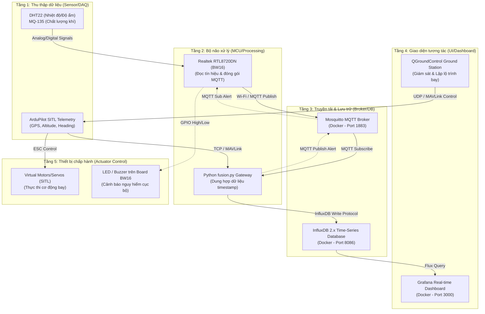

# IOT102_DRONE-PROJECT

> **Hệ thống giám sát Drone IoT tích hợp dữ liệu cảm biến thực tế và mô phỏng bay ảo.**
> 
> *A Drone IoT monitoring system integrating real-world sensor telemetry and simulated virtual flight data.*

---

## 📌 Tổng Quan Dự Án / Project Overview

Dự án này cung cấp tài liệu hướng dẫn và mã nguồn hoàn chỉnh nhằm thiết lập một hệ thống **Drone IoT** khép kín, đã được kiểm chứng hoạt động ổn định trên cả hai hệ điều hành **macOS (M-series)** và **Windows**.

Hệ thống hoạt động theo cơ chế dung hợp dữ liệu (Data Fusion):
1. **Dữ liệu thật**: Nhiệt độ (DHT22) và chất lượng không khí (MQ-135) từ board vật lý **BW16 (Realtek)** truyền qua giao thức **MQTT**.
2. **Dữ liệu ảo**: Tọa độ GPS, độ cao, vận tốc từ drone mô phỏng **ArduPilot SITL**.
3. **Gateway Fusion**: Script Python đồng bộ hóa hai luồng dữ liệu theo thời gian thực và đẩy lên cơ sở dữ liệu **InfluxDB**.
4. **Dashboard**: Trực quan hóa dữ liệu sinh động trên **Grafana**.

---

## 📂 Cấu Trúc Repository / Repository Structure

Kho lưu trữ được chia làm 2 thư mục độc lập tối ưu cho từng hệ điều hành:

```
IOT102_DRONE-PROJECT/
├── .gitignore
├── README.md                 <-- [Bạn đang ở đây / You are here]
│
├── DroneIoT_macOS/           <-- Dành cho macOS (Apple Silicon M1/M2/M3/M4)
│   ├── README.md             <-- Hướng dẫn chi tiết cho macOS
│   ├── Phase1_Docker/        <-- docker-compose.yml + mosquitto.conf + setup.sh
│   ├── Phase2_SITL/          <-- Scripts cài đặt & chạy ArduPilot SITL
│   ├── Phase3_BW16/          <-- Sketch Arduino (.ino) & Sơ đồ đấu nối phần cứng
│   ├── Phase4_Fusion/        <-- Python fusion.py + venv setup script
│   └── Phase5_Operations/    <-- Scripts khởi chạy/dừng toàn hệ thống & checklist
│
└── DroneIoT_Windows/         <-- Dành cho Windows 10/11 (Sử dụng WSL2)
    ├── README.md             <-- Hướng dẫn chi tiết cho Windows
    ├── Phase1_Docker/        <-- docker-compose.yml + setup.bat
    ├── Phase2_SITL/          <-- WSL2 setup guide & PowerShell run scripts
    ├── Phase3_BW16/          <-- Sketch Arduino & Sơ đồ đấu nối phần cứng
    ├── Phase4_Fusion/        <-- Python fusion.py + Batch venv setup script
    └── Phase5_Operations/    <-- Batch scripts khởi chạy/dừng toàn hệ thống & checklist
```

---

## 🚀 Kiến Trúc Hệ Thống 5 Tầng / 5-Layer System Architecture

Hệ thống được thiết kế và triển khai tuân thủ mô hình kiến trúc IoT tiêu chuẩn:



### Chi tiết các tầng:

1. **Tầng 1: Sensor / Actuator => Data Acquisition (Thu thập dữ liệu)**
   - **Môi trường thực**: Cảm biến DHT22 (Nhiệt độ, Độ ẩm) và MQ-135 (Chất lượng không khí) đo lường môi trường vật lý.
   - **Môi trường ảo**: Drone ảo ArduPilot SITL cung cấp dữ liệu GPS (Vĩ độ, Kinh độ), Độ cao (Altitude), Vận tốc (Heading/Velocity).
2. **Tầng 2: MCU/SBC => Processing (Xử lý)**
   - **Board Edge**: Vi điều khiển **Realtek RTL8720DN (BW16)** xử lý các tín hiệu thô analog/digital từ cảm biến và phát chu kỳ gửi dữ liệu.
   - **Bộ xử lý dung hợp (Gateway)**: Script Python `fusion.py` tiếp nhận đồng thời dữ liệu MAVLink và MQTT để thực hiện phép toán dung hợp tọa độ GPS với các chỉ số môi trường tương ứng tại thời điểm đo.
3. **Tầng 3: Cloud / MQTT Broker / Database (Truyền tải & Lưu trữ)**
   - **MQTT Broker**: Eclipse Mosquitto (Docker) chịu trách nhiệm chuyển tiếp tin nhắn gọn nhẹ từ board BW16.
   - **Database**: InfluxDB 2.x (Docker) lưu trữ dữ liệu dung hợp dưới dạng Time-Series để tối ưu hóa việc truy vấn và vẽ biểu đồ.
4. **Tầng 4: Dashboard / Web Control / Ground Station (Giao diện người dùng)**
   - **Ground Station**: QGroundControl kết nối với Drone SITL qua cổng UDP 14550 để lập lộ trình bay.
   - **Dashboard**: Grafana kết nối với InfluxDB 2.x để hiển thị trực quan dữ liệu.
   - **Web Control Interface**: Giao diện điều khiển trình duyệt tối giản kết nối trực tiếp Mosquitto qua cổng WebSocket 9001, cho phép phát lệnh còi/LED tới BW16 và lệnh bay tới SITL.
5. **Tầng 5: Actuator Control (Điều khiển chấp hành)**
   - **Drone ảo**: SITL nhận lệnh bay từ Web Control hoặc QGroundControl và điều khiển động cơ ảo cất cánh, hạ cánh.
   - **Phần cứng thực**: Board BW16 nhận lệnh từ Web Control hoặc tự động kích hoạt còi/LED cảnh báo khi nồng độ CO2 vượt ngưỡng 600.
   - **Bộ kiểm thử (Tests)**: Tích hợp sẵn 4 kịch bản kiểm thử tự động (Tính liên tục dữ liệu, Độ trễ, Khả năng chịu lỗi, Web Control) trong thư mục vận hành.

---

## 🔄 Tóm Tắt Luồng Dữ Liệu / Data Flow Summary

Hệ thống hoạt động theo vòng lặp khép kín:

| Thành Phần | Nguồn Dữ Liệu | Giao Thức Truyền | Nơi Tiếp Nhận |
| :--- | :--- | :--- | :--- |
| **Không gian ảo** | ArduPilot SITL | TCP / MAVLink | Python (Data Fusion) |
| **Môi trường thực** | BW16 + DHT22/MQ-135 | Wi-Fi / MQTT | MQTT Broker (Mosquitto) $\rightarrow$ Python |
| **Hợp nhất (Fusion)** | Script Python | InfluxDB API Protocol | Time-Series Database (InfluxDB) |
| **Hiển thị trực quan** | InfluxDB | Flux Query | Grafana Dashboard |
| **Phản hồi chấp hành** | QGroundControl / Gateway | UDP MAVLink / MQTT Pub | SITL Motor (ảo) / BW16 GPIO LED (thật) |

---

## 🔌 Hướng Dẫn Đấu Nối & Khởi Động Phần Cứng Chi Tiết / Detailed Hardware Guide

Để khởi động phần cứng và đưa dữ liệu thực tế vào hệ thống, thực hiện theo các bước chi tiết sau:

### 1. Chuẩn bị và Đấu nối phần cứng
Đấu nối các chân cảm biến với board BW16 dựa trên sơ đồ dưới đây. 

> [!WARNING]
> Cảm biến MQ-135 sử dụng nguồn 5V nhưng chân ADC của BW16 chỉ chịu được tối đa 3.3V. **Bắt buộc** phải sử dụng cầu phân áp (Voltage Divider) gồm 2 điện trở 10kΩ để hạ điện áp tín hiệu trước khi đưa vào chân `PB_1`.

* **Sơ đồ đấu nối chi tiết**:
  * **DHT22**: VCC $\rightarrow$ 3.3V, GND $\rightarrow$ GND, DATA $\rightarrow$ `PA_26` (Cần thêm điện trở pull-up 10kΩ giữa VCC và DATA).
  * **MQ-135**: VCC $\rightarrow$ 5V, GND $\rightarrow$ GND, AOUT $\rightarrow$ Cầu phân áp (Điểm giữa 2 điện trở 10kΩ nối vào `PB_1`).

### 2. Cài đặt môi trường & Cấu hình Code trên Arduino IDE
1. Mở Arduino IDE, cài đặt Board Package **AmebaD** (Tìm kiếm `AmebaD` trong Boards Manager) và cài đặt thư viện `DHT sensor library` + `PubSubClient`.
2. Mở tệp firmware `bw16_sensor.ino` nằm trong thư mục `Phase3_BW16`.
3. Cấu hình các thông số mạng của bạn trong code:
   ```cpp
   const char* ssid = "TEN_WIFI_CUA_BAN";
   const char* password = "MAT_KHAU_WIFI";
   const char* mqtt_server = "IP_MAY_TINH_CHAY_DOCKER"; // Ví dụ: "192.168.1.15"
   ```
4. Chọn đúng Board: `AmebaD (RTL8720DN)` $\rightarrow$ `BW16` và chọn đúng Cổng COM (Port) tương ứng với mạch.

### 3. Quy trình Nạp Code (Upload Mode) cho BW16
Nhấn nút trên board để đưa BW16 vào chế độ nạp khi Arduino IDE bắt đầu đếm ngược upload:
1. Nhấn nút **Upload** trên Arduino IDE.
2. Khi IDE bắt đầu hiện dòng log kết nối nạp, **nhấn và giữ** nút **BURN** trên board.
3. Trong khi vẫn giữ nút BURN, **nhấn và thả** nút **RESET** một lần.
4. **Thả** nút **BURN** ra. Màn hình IDE sẽ hiển thị tiến trình nạp phần trăm chạy đến `Upload Image done`.

### 4. Khởi động và Giám sát Phần cứng (Normal Execution Mode)
Sau khi nạp code thành công, board vẫn đang ở chế độ chờ nạp (Upload mode), bạn cần khởi động chạy thực tế:
1. **Nhấn nút RESET một lần** trên board (hoặc rút dây USB và cắm lại nguồn) để mạch tự khởi động lại ở chế độ chạy bình thường (Normal Mode).
2. Mở công cụ **Serial Monitor** trên Arduino IDE và chọn tốc độ Baudrate là **115200**.
3. **Quan sát nhật ký hoạt động:**
   * Mạch sẽ in ra quá trình kết nối Wi-Fi: `Connecting to SSID... Wi-Fi connected! IP address: 192.168...`
   * Mạch kết nối tới MQTT Broker: `Attempting MQTT connection... connected`
   * Mạch bắt đầu đọc cảm biến và gửi dữ liệu lên Broker:
     ```text
     Publishing: dht/temperature -> 28.50
     Publishing: dht/humidity -> 65.20
     Publishing: mq135/air_quality -> 125.00
     ```
4. **Đóng vòng lặp**: Led xanh lá cây trên board sẽ chớp tắt định kỳ báo hiệu trạng thái hoạt động tốt.

---

## 🚀 HƯỚNG DẪN VẬN HÀNH HỆ THỐNG TOÀN DIỆN (A - Z)

> [!IMPORTANT]  
> Quy trình khởi chạy các thành phần phải thực hiện **đúng thứ tự**:  
> **Docker Server $\rightarrow$ Board BW16 $\rightarrow$ SITL (Drone ảo) $\rightarrow$ Python Gateway (fusion.py) $\rightarrow$ Web Control & Grafana**

---

### BƯỚC 1: Khởi động Server Docker (MQTT, InfluxDB, Grafana)
1. Khởi động ứng dụng **Docker Desktop** trên máy tính của bạn.
2. Mở Terminal (macOS) hoặc Command Prompt (Windows) và di chuyển vào thư mục Docker:
   * **macOS:**
     ```bash
     cd ~/Desktop/IOT102_DRONE-PROJECT/DroneIoT_macOS
     bash Phase1_Docker/setup.sh
     ```
   * **Windows:**
     ```cmd
     cd C:\Users\Tên_User\Desktop\IOT102_DRONE-PROJECT\DroneIoT_Windows
     Phase1_Docker\setup.bat
     ```
3. Sau khi chạy xong, copy chuỗi **InfluxDB Token** dài hiển thị ở màn hình terminal.
4. Mở file `Phase4_Fusion/fusion.py` bằng trình soạn thảo và dán token này vào dòng cấu hình `INFLUX_TOKEN`:
   ```python
   INFLUX_TOKEN = "SỐ_TOKEN_CỦA_BẠN..."
   ```

---

### BƯỚC 2: Cài đặt và nạp code cho Board BW16
1. Đấu nối cảm biến DHT22, MQ-135, Buzzer và LED với board BW16 theo sơ đồ đấu nối ở trên.
2. Kết nối board BW16 vào máy tính qua cáp Micro-USB (cáp có đường truyền dữ liệu).
3. Mở **Arduino IDE** $\rightarrow$ Chọn file `Phase3_BW16/bw16_sensor.ino`.
4. Sửa WiFi SSID, Password và IP máy tính của bạn trong code.
5. Chọn Board là **BW16** và chọn đúng cổng COM.
6. Tiến hành **nạp code (Upload)** xuống board (đưa board vào chế độ nạp bằng cách giữ nút **BURN** + nhấn **RESET**).
7. Nhấn **RESET** một lần nữa sau khi nạp thành công để board chạy bình thường và truyền dữ liệu cảm biến.

---

### BƯỚC 3: Khởi động Drone ảo mô phỏng (ArduPilot SITL)
1. Mở một **Terminal mới** (không chạy chung với các lệnh khác):
   * **macOS:**
     ```bash
     cd ~/Desktop/IOT102_DRONE-PROJECT/DroneIoT_macOS
     bash Phase2_SITL/run_sitl.sh
     ```
   * **Windows (Mở PowerShell với quyền Admin):**
     ```powershell
     cd C:\Users\Tên_User\Desktop\IOT102_DRONE-PROJECT\DroneIoT_Windows
     powershell Phase2_SITL/run_sitl.ps1
     ```
2. Chờ từ 1-2 phút cho đến khi xuất hiện dòng `MAV>` và thông báo định vị GPS `AP: EKF3 IMU0 origin set`.
3. Mở phần mềm **QGroundControl** lên, phần mềm sẽ tự động kết nối với Drone ảo và hiển thị trạng thái `"Ready to Fly"`.

---

### BƯỚC 4: Khởi chạy Data Fusion Gateway (fusion.py)
1. Mở một **Terminal mới** thứ hai:
   * **macOS:**
     ```bash
     cd ~/Desktop/IOT102_DRONE-PROJECT/DroneIoT_macOS
     source Phase4_Fusion/drone_env/bin/activate
     python3 Phase4_Fusion/fusion.py
     ```
   * **Windows (Mở Command Prompt):**
     ```cmd
     cd C:\Users\Tên_User\Desktop\IOT102_DRONE-PROJECT\DroneIoT_Windows
     Phase4_Fusion\drone_env\Scripts\activate
     python Phase4_Fusion\fusion.py
     ```
2. Màn hình console sẽ bắt đầu in log kết nối thành công tới InfluxDB, MQTT, SITL và hiển thị log dung hợp dữ liệu sau mỗi 1 giây:
   `[FUSION] ✅ #0001 GPS: (-35.3632, 149.1652, 584.0m) T=28.5°C CO2=412`

---

### BƯỚC 5: Vận hành giao diện điều khiển Web Control
1. Dùng trình duyệt Web (Chrome, Edge, Safari) mở tệp tin giao diện tĩnh:
   `Phase5_Operations/web_control/index.html`
2. Quan sát biểu tượng **Status Badge** ở góc trên bên phải hiển thị **"Đã kết nối"** (màu xanh lá).
3. **Thao tác điều khiển:**
   * Nhấn nút **[ARM]** $\rightarrow$ Kích hoạt động cơ drone ảo.
   * Nhấn nút **[TAKEOFF 10m]** $\rightarrow$ Drone ảo sẽ tự động cất cánh lên độ cao 10 mét (xem chuyển động trên QGroundControl).
   * Nhấn nút **[BẬT CÒI]** / **[TẮT CÒI]** $\rightarrow$ Điều khiển trực tiếp còi buzzer kêu/tắt trên board BW16.

---

### BƯỚC 6: Trực quan hóa dữ liệu trên Grafana
1. Truy cập địa chỉ: **http://localhost:3000** (Đăng nhập: `admin` / `admin`).
2. Vào **Connections $\rightarrow$ Data Sources $\rightarrow$ Add data source $\rightarrow$ InfluxDB**.
3. Cấu hình các thông số InfluxDB:
   * **Query Language:** Chọn `Flux`.
   * **URL:** Điền `http://influxdb:8086`.
   * **Organization:** Điền `drone_org`.
   * **Bucket:** Điền `drone_data`.
   * **Token:** Dán InfluxDB Token thu được ở Bước 1.
   * Nhấn **Save & Test** để kích hoạt kết nối.
4. Tạo Dashboard và thêm các panel hiển thị chỉ số nhiệt độ, độ ẩm, độ cao bay.
5. **Cấu hình Bản đồ Geomap (Hiển thị vị trí & quỹ đạo bay):**
   * Tạo panel mới, chọn Visualization là **Geomap**.
   * Nhập câu truy vấn Flux sau:
     ```flux
     from(bucket: "drone_data")
       |> range(start: -30m)
       |> filter(fn: (r) => r._measurement == "drone_telemetry")
       |> filter(fn: (r) => r._field == "latitude" or r._field == "longitude")
       |> pivot(rowKey: ["_time"], columnKey: ["_field"], valueColumn: "_value")
     ```
   * Ở cột cấu hình bên phải, mục **Map Layer** $\rightarrow$ Chọn Mode là `Coords`, gán **Latitude field** = `latitude`, **Longitude field** = `longitude`. Nhấn **Apply**.

---

## 🧪 CHẠY CÁC KỊCH BẢN KIỂM THỬ TỰ ĐỘNG (INTEGRATION TESTS)

Hệ thống cung cấp sẵn 4 kịch bản kiểm thử tự động tại thư mục `Phase5_Operations/tests/`. Kích hoạt môi trường ảo Python và chạy các lệnh sau:

```bash
# 1. Kiểm tra tính liên tục của dữ liệu (Yêu cầu khoảng trống dữ liệu >3s < 5%)
python Phase5_Operations/tests/test_continuity.py

# 2. Đo độ trễ từ cảm biến truyền về DB (Yêu cầu tối đa < 2000ms)
python Phase5_Operations/tests/test_latency.py

# 3. Stress test MQTT và kiểm tra khả năng chịu lỗi (Tạo tệp báo cáo test_report.txt)
python Phase5_Operations/tests/test_fault_tolerance.py

# 4. Kiểm tra truyền nhận tin nhắn lệnh Web Control
python Phase5_Operations/tests/test_web_control.py
```

---

## 🛑 DỪNG HỆ THỐNG AN TOÀN

Khi kết thúc phiên làm việc, chạy script dừng hệ thống để tắt an toàn toàn bộ container Docker và tiến trình bay ảo:
* **macOS:**
  ```bash
  bash Phase5_Operations/stop_all.sh
  ```
* **Windows:**
  ```cmd
  Phase5_Operations\stop_all.bat
  ```

---

## 📝 Bản Quyền / License

Dự án này được xây dựng cho môn học **IOT102** - Trường Đại học FPT.  
*Phát triển bởi Khánh Tường.*
