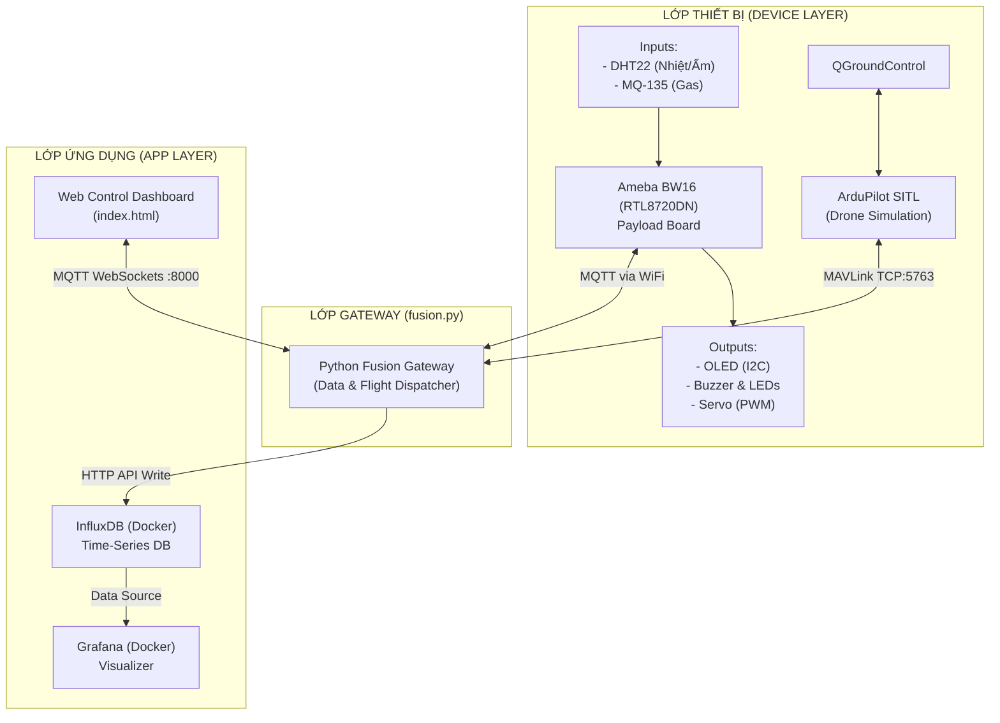

# Drone IoT — Mạch ứng dụng Hệ Thống Giám Sát & Điều Khiển UAV Thông Minh


Dự án IoT tích hợp Board **Ameba BW16 (RTL8720DN)** với cụm cảm biến môi trường và Servo thả hàng, kết nối qua **MQTT** về máy chủ Python Fusion Gateway trên macOS. Dữ liệu được lưu vào **InfluxDB** (Docker), hiển thị trực quan trên **Grafana** và điều khiển qua **Web Control Dashboard**.

---

## Kiến Trúc Hệ Thống



---

## Thành Phần Phần Cứng

| Linh kiện | Chân BW16 | Điện áp | Giao thức |
|:----------|:----------|:--------|:----------|
| DHT22 (Nhiệt/Ẩm) | DATA → PA30 | 3.3V | One-Wire |
| MQ-135 (Khí gas) | AOUT → PB3 | 5V | Analog ADC |
| OLED SSD1306 | SDA→PA26, SCL→PA25 | 3.3V | I2C |
| Servo SG90 | SIG → PA13 | 5V | PWM |
| Buzzer | I/O → PA14 | 3.3V | GPIO |
| LED Đỏ (Cảnh báo) | Anode → PA15 | 3.3V | GPIO |
| LED Xanh (An toàn) | Anode → PA27 | 3.3V | GPIO |

---

## Các Kịch Bản Ứng Dụng

Hệ thống mạch BW16 và Fusion Gateway này được thiết kế để hỗ trợ 2 kịch bản hoạt động:

1. **Bay thật (Real Flight):**
   Gắn mạch Ameba BW16 cùng các cụm cảm biến và Servo trực tiếp lên thân Drone thực tế. BW16 đóng vai trò làm *Payload Board*, thu thập thông tin môi trường và nhận lệnh thả hàng. Dữ liệu kết nối về trạm mặt đất (Gateway) qua WiFi/4G bằng MQTT, còn Drone nhận lệnh điều khiển bay MAVLink thực tế qua Telemetry Radio.

2. **Bay ảo (SITL Simulation):**
   Chạy ArduPilot SITL trên máy tính để mô phỏng drone (tạo ra toạ độ, độ cao ảo). Mạch BW16 vẫn được cấp nguồn thực tế và đo cảm biến thực tế, nhưng được dùng để kiểm thử phần mềm trên máy tính (Gateway + Web Dashboard). Cách này giúp phát triển code cực kỳ an toàn mà không sợ hỏng hóc thiết bị.

---

## Cài Đặt Lần Đầu

### Yêu cầu

- macOS M1/M2/M3/M4
- Docker Desktop
- Arduino IDE 2.x + Board Package **Ameba RTL8720DN 3.1.9**
- Python 3.10+
- ArduPilot SITL (`sim_vehicle.py`)

### Thư viện Arduino cần cài

1. `PubSubClient` (Nick O'Leary)
2. `DHT sensor library` (Adafruit)
3. `Adafruit GFX Library`
4. `Adafruit SSD1306`

### Bước 1: Cấu hình WiFi

Mở `Phase3_BW16/bw16_sensor/secrets.h` và điền thông tin mạng:

```cpp
#define SECRET_SSID "Ten_WiFi_Cua_Ban"
#define SECRET_PASS "Mat_Khau_WiFi"
```

> ⚠️ File `secrets.h` đã được thêm vào `.gitignore`. **Không commit** file này lên GitHub.

### Bước 2: Khởi động Docker

```bash
cd Phase1_Docker
bash setup.sh
```

Script tự động:
- Khởi động Mosquitto, InfluxDB, Grafana qua Docker Compose v2
- Tạo bucket `drone_data` trong InfluxDB
- Lưu token vào `Phase4_Fusion/.influx_token`

### Bước 3: Tạo Python venv

```bash
cd Phase4_Fusion
bash setup_venv.sh
```

### Bước 4: Nạp Firmware BW16

1. Mở `Phase3_BW16/bw16_sensor/bw16_sensor.ino` bằng Arduino IDE
2. Chọn **Board** → `AI-Thinker BW16`
3. Chọn **Port** (cổng USB của BW16)
4. Nhấn **Upload**
5. Mở **Serial Monitor** ở 115200 baud — xác nhận thấy `[SYSTEM] Setup hoan tat!`

---

## Khởi Động Hàng Ngày

> ⚠️ **Quan trọng:** Tất cả lệnh bên dưới phải chạy từ thư mục `IOT102_DRONE-PROJECT/`.

```bash
# Vào đúng thư mục gốc trước
cd <đường dẫn đến IOT102_DRONE-PROJECT>

# Một lệnh khởi động toàn bộ hệ thống
bash Phase5_Operations/start_all.sh
```

Hoặc thủ công từng bước (cũng chạy từ `IOT102_DRONE-PROJECT/`):

```bash
cd <đường dẫn đến IOT102_DRONE-PROJECT>

# 1. Docker
cd Phase1_Docker && docker compose up -d && cd ..

# 2. SITL (mở Terminal mới)
cd Phase2_SITL && bash run_sitl.sh

# 3. Fusion Gateway (Terminal khác)
cd Phase4_Fusion
source drone_env/bin/activate
python3 fusion.py
```

---

## Web Control Dashboard

Mở file `Phase5_Operations/web_control/index.html` bằng Chrome/Firefox (Ctrl+O / Cmd+O).

**Tính năng:**
- Hiển thị telemetry thời gian thực: Nhiệt độ, Độ ẩm, CO2, RSSI
- Điều khiển Drone: ARM / TAKEOFF 10m / LAND / RTL (có confirm dialog)
- Điều khiển Payload: Bật/tắt Còi, Đèn LED, Servo thả hàng
- Auto-reconnect MQTT khi mất kết nối (exponential backoff, tối đa 30s)
- Disable tất cả nút khi chưa kết nối (tránh lệnh nhầm)


## Dừng Hệ Thống

```bash
# Từ thư mục gốc IOT102_DRONE-PROJECT/
cd <đường dẫn đến IOT102_DRONE-PROJECT>
bash Phase5_Operations/stop_all.sh

# Hoặc thủ công
pkill -f fusion.py
cd Phase1_Docker && docker compose down
```


## Xử Lý Sự Cố

| Triệu chứng | Nguyên nhân | Giải pháp |
|:------------|:------------|:----------|
| `No such file or directory` khi chạy script | Đang ở sai thư mục | `cd IOT102_DRONE-PROJECT` trước, rồi `bash Phase5_Operations/start_all.sh` |
| Serial Monitor in `Error amb_ard_pin_check_fun` | `Wire.begin()` bị gọi 2 lần | Đã sửa trong v2.6 |
| OLED không hiển thị cảnh báo gas | `is_alert` scoping sai | Đã sửa trong v3.0 |
| Web không kết nối được MQTT | CDN Paho sai filename | Đã sửa trong v3.0 |
| Gateway bị treo khi gửi TAKEOFF | `master_lock` contention | Đã sửa trong v3.0 |
| InfluxDB không nhận data | Token sai/rỗng | Chạy lại `setup.sh`, kiểm tra `.influx_token` |
| BW16 không kết nối WiFi | Sai SSID/pass | Kiểm tra `secrets.h` |

---

## Cấu Trúc Thư Mục

```text
IOT102_DRONE-PROJECT/
├── Phase1_Docker/
│   ├── docker-compose.yml      # Mosquitto 2.0, InfluxDB 2.0, Grafana 10.4
│   ├── mosquitto/mosquitto.conf
│   └── setup.sh                # Chạy 1 lần đầu
├── Phase2_SITL/
│   ├── install_sitl.sh
│   └── run_sitl.sh
├── Phase3_BW16/
│   └── bw16_sensor/
│       ├── bw16_sensor.ino     # Firmware v3.3
│       └── secrets.h           # ← KHÔNG commit file này
├── Phase4_Fusion/
│   ├── fusion.py               # Gateway v3.3
│   ├── requirements.txt
│   └── setup_venv.sh
└── Phase5_Operations/
    ├── start_all.sh
    ├── stop_all.sh
    └── web_control/
        └── index.html          # Dashboard v3.3
```

---

> **Tác giả:** IOT102 Drone Project — Team  
> **Môi trường:** macOS Apple Silicon + ArduPilot SITL + HiveMQ Public Broker
