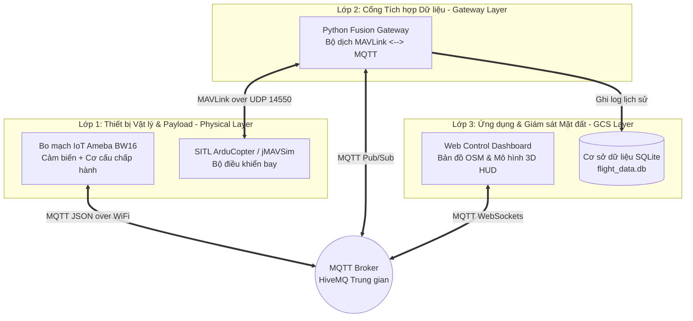

# TÀI LIỆU GIẢI THÍCH TOÀN DIỆN ĐỒ ÁN TỐT NGHIỆP
## HỆ THỐNG GIÁM SÁT MÔI TRƯỜNG VÀ ĐIỀU KHIỂN TẢI TRỌNG TRÊN DRONE TÍCH HỢP IOT (MAVLINK – MQTT FUSION GATEWAY)

---

## 1. TỔNG QUAN & MỤC TIÊU ĐỀ TÀI

### 1.1. Bối cảnh & Vấn đề thực tế
Trong các ứng dụng máy bay không người lái (UAV/Drone) hiện đại như quan trắc môi trường, tuần tra rừng hay cứu hộ cứu nạn, hệ thống thường gặp hai thách thức lớn:
1. **Sự chia cắt giao thức (Protocol Segregation):** Các bộ điều khiển bay (Flight Controller - FC) dùng giao thức nhị phân **MAVLink** qua sóng vô tuyến/UDP, trong khi các mạng cảm biến IoT và nền tảng giám sát web lại sử dụng giao thức **MQTT/HTTP/JSON**.
2. **Quá tải bộ điều khiển bay chính:** Việc gắn trực tiếp cảm biến môi trường hoặc các cơ cấu chấp hành ngoại vi lên Flight Controller dễ gây nhiễu luồng điều khiển bay an toàn thời gian thực.

### 1.2. Giải pháp của Đồ án
Đồ án xây dựng một kiến trúc **Decoupled Architecture (Kiến trúc phân tách độc lập)**:
- Sử dụng bo mạch IoT vi điều khiển **Realtek Ameba BW16 (RTL8720DN)** chuyên trách đọc cụm cảm biến môi trường và điều khiển ngoại vi tải trọng (Payload Servo, Buzzer, OLED).
- Xây dựng **Cổng tích hợp đa luồng Python (Fusion Gateway)** đóng vai trò cầu nối song hướng giữa giao thức hàng không **MAVLink** và giao thức IoT **MQTT**.
- Phát triển **Trạm điều khiển mặt đất nền tảng Web (Web GCS Dashboard)** tích hợp bản đồ bay động, mô hình thái độ 3D (3D Attitude) xoay mượt mà 60 FPS và điều khiển thả hàng theo thời gian thực.

---

## 2. KIẾN TRÚC TỔNG THỂ 3 LỚP (3-LAYER ARCHITECTURE)



### Phân vai từng lớp:
- **Lớp 1 (Edge / Physical Layer):** Tương tác vật lý với môi trường bay và cơ cấu chấp hành.
- **Lớp 2 (Gateway Layer):** Bộ chuyển dịch ngôn ngữ và tổng hợp dữ liệu trung gian.
- **Lớp 3 (Application Layer):** Trực quan hóa dữ liệu, tương tác HMI và lưu trữ kiểm toán.

---

## 3. CHI TIẾT TỪNG THÀNH PHẦN & CẤU TRÚC MÃ NGUỒN (CORE SOURCE FILES)

Toàn bộ hệ thống nộp Hội đồng được tinh gọn còn **8 tệp mã nguồn chính**:

### 3.1. Lớp 1 — Nhúng IoT Payload (`1_Firmware_BW16/bw16_sensor.ino`)
- **Phần cứng sử dụng:** Board Realtek Ameba BW16 (Arm Cortex-M4/M0 kép, hỗ trợ WiFi 2.4GHz/5GHz).
- **Cảm biến đầu vào:**
  - `DHT22` (Chân PA27): Đo nhiệt độ và độ ẩm không khí.
  - `MQ-135` (Chân A0/PB03): Phát hiện nồng độ khí độc CO2/NH3 trong không khí.
  - `HC-SR04` (Trig PB02, Echo PB01): Đo khoảng cách hạ cánh của tải trọng.
- **Cơ cấu đầu ra:**
  - `OLED SSD1306` (I2C PA26/PA25): Hiển thị thông số trực tiếp trên máy bay.
  - `Servo SG90/MG996R` (Chân PA12): Cơ cấu đóng/mở móc thả hàng cứu trợ.
  - `Buzzer & LED Cảnh báo` (Chân PB04/PA13): Kích hoạt tự động khi nồng độ khí vượt ngưỡng.
- **Cơ chế hoạt động:** Chu kỳ **2 giây/lần**, bo mạch thu thập toàn bộ dữ liệu, đóng gói thành chuỗi JSON và gửi lên kênh MQTT `iot102_drone/payload/sensors`.

### 3.2. Lớp 2 — Cổng tích hợp đa luồng (`2_Backend_Fusion/`)
Được viết bằng Python 3 theo mô hình đa luồng phi đồng bộ (Asynchronous Multi-threading):

1. **`main.py`:** Điểm điều phối chính, khởi tạo đồng thời các luồng kết nối MAVLink và MQTT để đảm bảo không chặn tiến trình của nhau.
2. **`mavlink_handler.py`:**
   - Kết nối UDP `14550` vào bộ điều khiển bay (SITL ArduCopter / PX4 jMAVSim).
   - Lắng nghe gói tin `ATTITUDE`, `GLOBAL_POSITION_INT`, `SYS_STATUS` ở tần số cao (10–60Hz).
   - Gửi lệnh điều khiển bay MAVLink: `TAKEOFF`, `ARM`, `RTL`, và nạp danh sách điểm bay tự động (`MISSION_ITEM_INT`).
3. **`mqtt_handler.py`:**
   - Lắng nghe các lệnh điều khiển từ Web GCS (`flight`, `payload`, `mission`).
   - Xuất bản dữ liệu tổng hợp (`sensors`, `attitude`, `telemetry`) ra MQTT Broker.
4. **`db_logger.py`:**
   - Tự động ghi lại toàn bộ hành trình bay và thông số vi khí hậu vào cơ sở dữ liệu quan hệ **SQLite (`flight_data.db`)**.

### 3.3. Lớp 3 — Trạm điều khiển mặt đất (`3_Web_GCS_Dashboard/`)
1. **`index.html` & `assets/css/styles.css`:**
   - Giao diện người dùng theo phong cách **Modern Glassmorphism (Nền tối, thẻ kính mờ)**.
   - Bố cục gồm 4 phân vùng chính: Bản đồ bay Leaflet OSM, Mô hình Attitude 3D HUD, Bảng biểu đồ trực quan Real-time, và Bảng điều khiển bay/ngoại vi.
2. **`assets/js/app.js`:**
   - Xử lý kết nối MQTT WebSockets (`wss://broker.hivemq.com:8884/mqtt`).
   - Thuật toán nội suy hình học **SLERP 3D Attitude** đảm bảo mô hình bay xoay mượt mà 60 khung hình/giây.

---

## 4. CÁC ĐIỂM SÁNG KỸ THUẬT & THUẬT TOÁN NỔI BẬT (TECHNICAL HIGHLIGHTS)

### 4.1. Thuật toán Nội suy SLERP 3D Attitude (60 FPS Smooth Rendering)
- **Vấn đề:** Dữ liệu góc nghiêng (Roll/Pitch/Yaw) gửi từ Drone qua đường truyền không dây thường có tần số thấp (5–10 Hz) hoặc bị rớt gói, khiến mô hình 3D trên Web bị giật cục (stuttering).
- **Giải pháp:** Sử dụng hàm nội suy Quaternion tuyến tính dạng cầu (**SLERP - Spherical Linear Interpolation**). Thay vì gán góc quay ngay lập tức, `app.js` chuyển đổi góc Euler sang Quaternion và tính toán nội suy từng khung hình trong vòng lặp dựng hình 60 FPS (`requestAnimationFrame`).

```javascript
// Minh họa cơ chế nội suy SLERP trong app.js
targetQuaternion.setFromEuler(new THREE.Euler(targetPitch, targetYaw, targetRoll));
currentMesh.quaternion.slerp(targetQuaternion, 0.15); // Xoay mượt mà 15% mỗi khung hình
```

### 4.2. Điều khiển Servo Phi đồng bộ (Non-blocking Servo Control)
- **Vấn đề:** Nếu dùng lệnh `delay(600)` trong hàm xử lý callback MQTT của Arduino để chờ Servo quay xong, vi điều khiển sẽ bị chặn luồng mạng, dẫn đến mất kết nối MQTT hoặc rớt gói tin.
- **Giải pháp:** Thiết kế máy trạng thái phi đồng bộ (Non-blocking State Machine) trong `bw16_sensor.ino`:
  - Khi nhận lệnh mở Servo, hệ thống bật xung PWM (`attach()`) và đặt mốc thời gian hết hạn `servo_detach_time = millis() + 1500`.
  - Trong hàm `loop()`, khi đạt đủ 1.5 giây, hệ thống tự động ngắt xung PWM (`detach()`), giúp Servo hoàn toàn im lặng khi nghỉ (idle), không bị rung rè rè và tiết kiệm dòng điện.

---

## 5. BỘ CÂU HỎI BẢO VỆ TRƯỚC HỘI ĐỒNG (DEFENSE Q&A)

#### Q1: Tại sao không nối trực tiếp cảm biến môi trường vào Flight Controller (ArduPilot/PX4) mà phải tách sang board BW16 riêng?
> **Trả lời:** Flight Controller chịu trách nhiệm cao nhất về an toàn bay (tính toán PID 400-1000Hz cho động cơ). Nếu gộp các cảm biến khí độc, đọc I2C OLED hay xử lý nối mạng WiFi/MQTT vào Flight Controller sẽ làm chiếm dụng CPU, tăng độ trễ ngắt (interrupt latency), nguy cơ gây rơi máy bay. Kiến trúc phân tách giúp cô lập lỗi: bo mạch IoT có lỗi hay mất mạng thì máy bay vẫn bay an toàn tuyệt đối.

#### Q2: Tại sao hệ thống lại dùng song song 2 giao thức MAVLink và MQTT?
> **Trả lời:** MAVLink là chuẩn nhị phân (Binary Protocol) siêu nhỏ gọn (vài chục bytes) tối ưu cho đường truyền vô tuyến băng thông thấp của hàng không. MQTT là chuẩn Pub/Sub nền tảng IoT tối ưu cho việc truyền phát đa điểm, dễ dàng tích hợp Web và Database. Cổng Gateway `fusion.py` giúp tận dụng ưu điểm của cả hai thế giới này.

#### Q3: Làm sao chứng minh hệ thống hoạt động tốt nếu không bay thật ngoài trời?
> **Trả lời:** Đồ án áp dụng phương pháp chuẩn công nghiệp hàng không **SITL (Software-In-The-Loop)** kết hợp mô phỏng vật lý 3D **jMAVSim**. Lớp điều khiển bay và giao thức MAVLink xuất ra từ SITL hoàn toàn giống 100% so với board bay thực tế (Pixhawk/Cube). Khi kết nối với bo mạch IoT thật BW16 trên bàn Hội đồng, đây là kiến trúc **HIL/SITL Hybrid** hoàn chỉnh và sẵn sàng triển khai thực tế.
